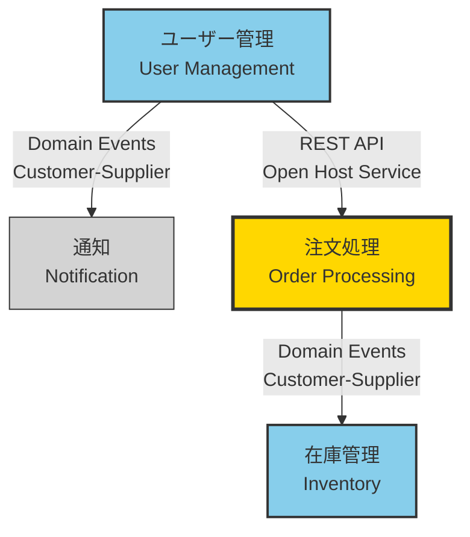

# ドメインモデル (Event Storming)

<!--
何を書くか: Event Storming形式でドメインモデルを記述したドキュメント

目的:
  - ビジネスドメインの境界（Bounded Context）を明確化
  - 各コンテキスト内のEvent Storming要素を体系的に整理
  - ドメイン間の関係性を可視化
  - チーム間の共通理解を構築

Event Storming形式とは:
  - Alberto Brandolini考案のドメインモデリング手法
  - Actors, Commands, Events, Policies, Aggregatesなどの要素で構成
  - 時系列に沿った業務フローの表現
  - 色分けされた要素分類（付箋の色に対応）

ドキュメント構成:
  1. 各Bounded Contextごとにセクションを分ける
  2. 各Context内でEvent Storming要素をリスト化
  3. 最後にContext Map（全体の関係図）を記述

更新頻度:
  - ドメインモデリング完了後に初版作成
  - スプリントレビュー時に見直し
  - 新しいBounded Contextや要素の発見時に追加
-->

---

## Bounded Context: [コンテキスト名]

<!--
各Bounded Context（境界づけられたコンテキスト）を個別に記述
複数のBounded Contextがある場合は、このセクションを繰り返す

【コンテキスト名】
  - ビジネス領域を表す名前（ユビキタス言語を使用）
  - 例: 「ユーザー管理」「注文処理」「在庫管理」「決済」

【戦略的分類】
  - Core Domain: ビジネスの競争優位性を生む中核領域
  - Supporting Domain: コアをサポートする重要な領域
  - Generic Domain: 汎用的な機能（既製品で代替可能）
-->

### 概要

**戦略的分類**: <!-- Core / Supporting / Generic -->

**責務**:
<!-- このBounded Contextが担当するビジネス機能を1-2文で記述 -->

**主要な責任**:
- <!-- 責任1 -->
- <!-- 責任2 -->
- <!-- 責任3 -->

---

### Actors（アクター）

<!--
コマンドを発行する人やシステム

【記載内容】
  - アクター名: ユーザーの役割やシステム
  - 説明: アクターの責任や権限
  - 例: 「管理者」「エンドユーザー」「外部API」

【Event Storming表記】小さな黄色の付箋

記載のポイント:
  - このBounded Context内で行動するアクターのみ記載
  - 技術的な役割ではなく、ビジネス上の役割で記述
-->

| アクター | 説明 |
|---------|------|
| <!-- 例: 管理者 --> | <!-- 例: システム設定を管理し、ユーザー権限を制御する --> |
| <!-- 例: エンドユーザー --> | <!-- 例: サービスを利用する一般ユーザー --> |

---

### Commands（コマンド）

<!--
アクターが発行する指示・アクション

【記載内容】
  - コマンド名: 命令形で記述
  - 発行者: どのアクターが実行するか
  - 説明: コマンドの目的と効果

【Event Storming表記】青色の付箋

フォーマット:
  - 動詞で始める: 「登録する」「更新する」「削除する」「承認する」
  - ユーザーの意図を表現
  - 例: 「ユーザーを登録する」「注文を確定する」「在庫を補充する」

記載のポイント:
  - コマンドは必ずDomain Eventをトリガーする
  - UIのボタンやAPIエンドポイントに対応することが多い
-->

| コマンド | 発行者 | 説明 |
|---------|--------|------|
| <!-- 例: ユーザーを登録する --> | <!-- 例: エンドユーザー --> | <!-- 例: 新しいユーザーアカウントを作成する --> |
| <!-- 例: プロフィールを更新する --> | <!-- 例: エンドユーザー --> | <!-- 例: 既存ユーザーの情報を変更する --> |

---

### Domain Events（ドメインイベント）

<!--
ビジネスにとって重要な出来事

【記載内容】
  - イベント名: 過去形で記述
  - トリガー: どのコマンドから発生するか
  - 説明: イベントの意味とビジネスへの影響

【Event Storming表記】オレンジ色の付箋

フォーマット:
  - 過去形で記述: 「〜された」「〜完了」
  - ビジネスにとって意味のある出来事を表現
  - 例: 「ユーザー登録完了」「注文確定」「決済成功」

記載のポイント:
  - 技術的なイベント（「DBに保存」）ではなく、ビジネスイベント
  - 他のBounded Contextに通知される可能性のあるイベント
  - 時系列に沿って並べると業務フローが見えやすい
-->

| ドメインイベント | トリガー（コマンド） | 説明 |
|-----------------|---------------------|------|
| <!-- 例: ユーザー登録完了 --> | <!-- 例: ユーザーを登録する --> | <!-- 例: 新しいユーザーがシステムに登録された --> |
| <!-- 例: プロフィール更新完了 --> | <!-- 例: プロフィールを更新する --> | <!-- 例: ユーザー情報が変更された --> |

---

### Policies（ポリシー）

<!--
自動化ルールやビジネスルール

【記載内容】
  - ポリシー名: ルールの名称
  - 条件: "Whenever [イベント]"
  - アクション: "Then [コマンド]"
  - 説明: ルールの詳細

【Event Storming表記】紫/ライラック色の付箋

フォーマット:
  - "Whenever [イベント], then [コマンド]"
  - "If [条件], then [アクション]"
  - 例: "Whenever ユーザー登録完了, then ウェルカムメールを送信する"

記載のポイント:
  - イベントからコマンドへの自動的な流れを表現
  - コードで実装される場合とオペレーターが手動で実行する場合がある
  - ビジネスロジックの重要な部分
-->

| ポリシー | 条件（Whenever） | アクション（Then） | 説明 |
|---------|-----------------|-------------------|------|
| <!-- 例: ウェルカムメール送信 --> | <!-- 例: ユーザー登録完了 --> | <!-- 例: ウェルカムメールを送信する --> | <!-- 例: 新規ユーザーに対して自動的にメールを送信 --> |
| <!-- 例: 管理者通知 --> | <!-- 例: 不正ログイン検知 --> | <!-- 例: 管理者に通知する --> | <!-- 例: セキュリティイベント発生時に管理者へ警告 --> |

---

### Aggregates（集約）

<!--
一貫性を保つべきエンティティの集まり

【記載内容】
  - Aggregate名: 集約のルートエンティティ
  - 責務: この集約が保護するビジネスルール
  - 含まれるエンティティ: 集約内のオブジェクト

【Event Storming表記】大きな黄色の付箋

DDDの概念:
  - コマンドを受け取り、ビジネスルールを適用し、イベントを発行する
  - トランザクション境界を定義
  - 一貫性の保証範囲
  - 1つのAggregateは1つのルートエンティティを持つ

記載のポイント:
  - Aggregateは独立してデプロイ可能な単位
  - 他のAggregateとは疎結合
  - イベントを通じて連携
-->

| Aggregate | 責務 | 含まれるエンティティ |
|-----------|------|---------------------|
| <!-- 例: User --> | <!-- 例: ユーザーの認証情報とプロフィールの整合性を保つ --> | <!-- 例: User, Profile, Credentials --> |
| <!-- 例: Order --> | <!-- 例: 注文の状態遷移とビジネスルールを管理 --> | <!-- 例: Order, OrderItem, ShippingAddress --> |

---

### Read Models（読み取りモデル）

<!--
UIに表示する情報

【記載内容】
  - Read Model名: 画面やビューの名称
  - 表示データ: 必要な情報の一覧
  - 利用者: どのアクターが使用するか

【Event Storming表記】緑色の付箋

CQRSの概念:
  - Command（書き込み）とQuery（読み込み）を分離
  - Read Modelは最適化された読み取り専用のデータ構造
  - イベントから非同期に構築されることが多い

記載のポイント:
  - ドメインモデルとは別の最適化されたモデル
  - UIのニーズに合わせた構造
  - 複数のAggregateからデータを集約する場合もある
-->

| Read Model | 表示データ | 利用者 |
|-----------|----------|--------|
| <!-- 例: ユーザープロフィール画面 --> | <!-- 例: 名前, メール, アバター, 登録日, 最終ログイン --> | <!-- 例: エンドユーザー --> |
| <!-- 例: ユーザー一覧画面 --> | <!-- 例: ID, 名前, ステータス, 登録日 --> | <!-- 例: 管理者 --> |

---

### External Systems（外部システム）

<!--
このBounded Contextが連携する外部システム

【記載内容】
  - システム名: 外部システムの名称
  - 連携方法: API, メッセージング, バッチなど
  - 目的: なぜ連携が必要か

【Event Storming表記】ピンク色の大きな付箋

記載のポイント:
  - 外部システムとの境界を明確にする
  - Anticorruption Layer（腐敗防止層）の必要性を検討
  - 外部システムの障害がこのContextに与える影響を考慮
-->

| 外部システム | 連携方法 | 目的 |
|------------|---------|------|
| <!-- 例: メール送信サービス --> | <!-- 例: REST API --> | <!-- 例: ウェルカムメールや通知メールの送信 --> |
| <!-- 例: 認証プロバイダ --> | <!-- 例: OAuth 2.0 --> | <!-- 例: ソーシャルログイン機能の提供 --> |

---

## 次のBounded Context

<!--
上記のセクション構造を繰り返して、他のBounded Contextを記述
各Contextは独立して理解できるように記述
-->

---

## Context Map（コンテキスト間の関係図）

<!--
すべてのBounded Context間の関係性を可視化

目的:
  - ドメイン間の依存関係を明確化
  - チーム間の連携方法を定義
  - アーキテクチャの全体像を把握

Context Mapping Patterns（関係性のパターン）:
  - Shared Kernel: 共有カーネル（共通のモデルを共有）
  - Customer-Supplier: 顧客-供給者関係（下流が上流に依存）
  - Conformist: 順応者（上流の変更に従う）
  - Anticorruption Layer: 腐敗防止層（変換層を介して連携）
  - Open Host Service: 公開ホストサービス（API経由で提供）
  - Published Language: 公開言語（共通のデータフォーマット）
  - Partnership: パートナーシップ（相互依存、共同開発）
  - Separate Ways: 独立した道（連携なし）

エッジラベルの記載:
  - パターン名: どの関係性パターンか
  - 通信方法: REST API, イベント, GraphQLなど
  - データ: やり取りされる主要なデータ
-->

---

## Context間の関係性一覧

<!--
Context Map図を補足する詳細情報
-->

| 上流Context | 下流Context | 関係パターン | 通信方法 | やり取りされるデータ |
|------------|------------|-------------|---------|-------------------|
| <!-- 例: ユーザー管理 --> | <!-- 例: 通知 --> | <!-- 例: Customer-Supplier --> | <!-- 例: Domain Events (Kafka) --> | <!-- 例: ユーザー登録完了イベント --> |
| <!-- 例: ユーザー管理 --> | <!-- 例: 注文処理 --> | <!-- 例: Open Host Service --> | <!-- 例: REST API --> | <!-- 例: ユーザー情報取得 --> |

---

## メモ

<!--
全体に関する補足情報:
  - ドメインモデル作成日と関与したメンバー
  - 次回レビューの予定
  - アーキテクチャ上の重要な決定事項
  - 技術的な制約や前提条件
-->
