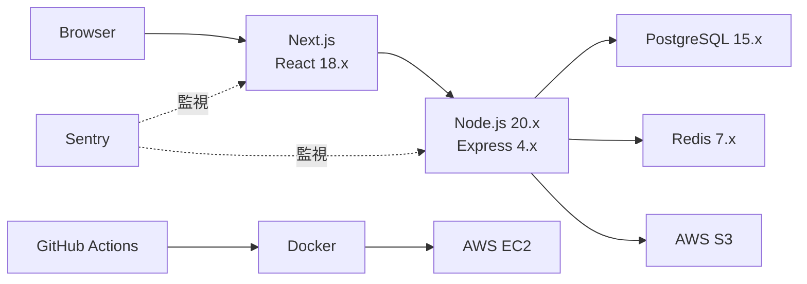

# テックスタック

<!--
何を書くか: プロジェクトで使用する技術・ツール・ライブラリの一覧

目的:
  - 技術選定の透明性を確保
  - チームメンバーの学習計画を支援
  - 技術的負債の可視化
  - セキュリティパッチやバージョンアップの計画
  - 新規メンバーのオンボーディング資料

重要性:
  - アーキテクチャ決定の記録（ADR: Architecture Decision Record）の一部
  - 技術選定の理由を明確化（なぜその技術を選んだか）
  - 互換性や依存関係の管理
  - ライセンスコンプライアンス

記載のポイント:
  - レイヤーごとに整理（フロントエンド、バックエンド、インフラなど）
  - バージョンを明記（メジャーバージョンは必須）
  - 選定理由をメモ欄に記載
  - EOL（End of Life）を考慮

更新頻度:
  - プロジェクト初期に作成
  - 新しい技術を導入する際に更新
  - バージョンアップ時に更新
  - 四半期ごとに見直し（セキュリティ、EOL確認）
-->

---

## テックスタック一覧

<!--
テーブル構成:

【レイヤー】
プロジェクトのアーキテクチャを層で分類:
  - フロントエンド: UIフレームワーク、状態管理、スタイリング
  - バックエンド: サーバーサイド言語、フレームワーク、API
  - データベース: RDBMS、NoSQL、検索エンジン
  - キャッシュ: インメモリDB、CDN
  - インフラ: クラウドプロバイダー、コンテナ、オーケストレーション
  - CI/CD: 継続的インテグレーション/デリバリー
  - 監視: ログ、メトリクス、エラートラッキング
  - テスト: ユニットテスト、E2Eテスト、負荷テスト
  - 開発ツール: IDE、リンター、フォーマッター
  - セキュリティ: 認証、暗号化、脆弱性スキャン
  - その他: メール、通知、ストレージなど

【技術/ツール】
  - 具体的な技術名やツール名
  - 公式名称を使用（略称は避ける）
  - 例: React、Next.js、PostgreSQL、Docker

【バージョン】
  - メジャーバージョンは必須（例: 18.x、20.x）
  - マイナー・パッチバージョンも記載可能（例: 18.2.0）
  - LTS（Long Term Support）の場合は明記
  - 特定バージョンに依存する場合は具体的に記載

【選定タイミング】
  - 初期: プロジェクト開始時に必須の決定（言語、フレームワーク、データベース、インフラ、CI/CD、基本テストツール）
  - 中期: 主要機能実装後に導入可能（E2Eテスト、パフォーマンステスト、高度な開発ツール）
  - 後期: 本番運用フェーズで必要になる（監視、ログ集約、APM、キャッシュ層、CDN最適化）
  - 随時: 必要に応じて追加（特定ライブラリ、ツール）

【メモ】
  - 選定理由（なぜこの技術を選んだか）
  - 代替案との比較結果
  - EOL（End of Life）の日付
  - ライセンス情報（特に商用利用の場合）
  - 制約事項や注意点
  - 移行計画（レガシーから移行中の場合）
  - タイミングが「後期」の場合は導入条件も記載（例: 「ユーザー数1000人突破時」「本番リリース1週間前」）

記載のベストプラクティス:
  - バージョンは定期的に確認・更新
  - セキュリティアップデートは優先的に適用
  - 技術選定の背景をメモ欄に残す（将来的な見直しに役立つ）
  - EOLが近い技術は早めに移行計画を立てる
  - ライセンスを確認（特にオープンソース）
-->

| レイヤー | 技術/ツール | バージョン | 選定タイミング | メモ |
|----------|------------|-----------|--------------|------|
| <!-- 例: フロントエンド --> | <!-- 例: React --> | <!-- 例: 18.x --> | <!-- 例: 初期 --> | <!-- 例: コンポーネントベース開発、エコシステム充実 --> |
| <!-- 例: フロントエンド --> | <!-- 例: Next.js --> | <!-- 例: 14.x --> | <!-- 例: 初期 --> | <!-- 例: SSR/SSG、App Router使用 --> |
| <!-- 例: バックエンド --> | <!-- 例: Node.js --> | <!-- 例: 20.x LTS --> | <!-- 例: 初期 --> | <!-- 例: 2026年4月までサポート --> |
| <!-- 例: バックエンド --> | <!-- 例: Express --> | <!-- 例: 4.x --> | <!-- 例: 初期 --> | <!-- 例: 軽量、柔軟性が高い --> |
| <!-- 例: データベース --> | <!-- 例: PostgreSQL --> | <!-- 例: 15.x --> | <!-- 例: 初期 --> | <!-- 例: ACID準拠、JSON対応 --> |
| <!-- 例: キャッシュ --> | <!-- 例: Redis --> | <!-- 例: 7.x --> | <!-- 例: 後期 --> | <!-- 例: セッション管理、キュー。パフォーマンス要件に応じて導入 --> |
| <!-- 例: インフラ --> | <!-- 例: AWS --> | <!-- 例: - --> | <!-- 例: 初期 --> | <!-- 例: EC2, RDS, S3, CloudFront使用 --> |
| <!-- 例: CI/CD --> | <!-- 例: GitHub Actions --> | <!-- 例: - --> | <!-- 例: 初期 --> | <!-- 例: .github/workflows/で管理 --> |
| <!-- 例: 監視 --> | <!-- 例: Sentry --> | <!-- 例: - --> | <!-- 例: 後期 --> | <!-- 例: エラートラッキング。本番運用開始時に導入 --> |
| <!-- 例: テスト --> | <!-- 例: Jest --> | <!-- 例: 29.x --> | <!-- 例: 初期 --> | <!-- 例: ユニットテスト --> |
| <!-- 例: テスト --> | <!-- 例: Playwright --> | <!-- 例: 1.x --> | <!-- 例: 中期 --> | <!-- 例: E2Eテスト。主要機能実装後に導入 --> |

---

## 技術選定の基準

<!--
技術選定時の判断基準を記録

このセクションはオプションですが、記載することで:
  - 将来的な技術選定の一貫性を保つ
  - 新しいチームメンバーが判断基準を理解できる
  - 技術評価のフレームワークを提供

記載すべき項目:
  1. パフォーマンス要件
     - 応答時間、スループット、スケーラビリティ

  2. 開発者体験（DX）
     - 学習コスト、ドキュメント充実度、エコシステム

  3. コミュニティとサポート
     - アクティブな開発、セキュリティパッチ、LTS

  4. コスト
     - ライセンス費用、インフラコスト、開発コスト

  5. チームのスキルセット
     - 既存の知識、学習曲線、採用市場

  6. 互換性
     - 既存システムとの統合、データ移行

  7. セキュリティ
     - 脆弱性履歴、セキュリティベストプラクティス

  8. ベンダーロックイン
     - 特定ベンダーへの依存度、移行コスト
-->

**主要な選定基準:**

- **成熟度**: 本番環境での実績、安定性
- **コミュニティ**: アクティブな開発、豊富な資料
- **パフォーマンス**: 非機能要件を満たすか
- **チームスキル**: 既存の知識、学習容易性
- **エコシステム**: ライブラリ、ツールの充実度
- **長期サポート**: EOL、LTS、アップグレードパス

---

## 技術選定のタイミング戦略

<!--
技術選定のタイミングを4つのフェーズに分類

このセクションの目的:
  - プロジェクト開始時に「何を決めるべきか」「何を後回しにできるか」を明確化
  - 過剰な事前設計を避け、必要なタイミングで技術を導入
  - 初期コストを抑え、段階的に成熟度を高める
  - チームの学習曲線を考慮した計画的な技術導入

よくある失敗パターン:
  - ❌ 最初から全ての技術を決定 → 過剰設計、初期コスト増大
  - ❌ 監視ツールを後回し → 本番障害の原因特定困難
  - ❌ E2Eテストを初期導入 → UI変更が多い初期フェーズで保守コスト増

推奨アプローチ:
  - ✅ 初期: 変更コストが高い技術のみ決定（言語、DB、インフラ）
  - ✅ 中期: 主要機能安定後に品質ツール導入（E2E、パフォーマンステスト）
  - ✅ 後期: 本番運用で必要な observability を導入（監視、ログ、トレーシング）
-->

### 初期フェーズ（プロジェクト開始時）

**決定すべき技術**:
- プログラミング言語、フレームワーク
- データベース（RDBMS/NoSQL）
- インフラプロバイダー（AWS/GCP/Azure）
- CI/CD パイプライン
- 基本的なテストツール（ユニットテスト）
- バージョン管理戦略

**理由**: これらは後から変更するコストが非常に高い。アーキテクチャの基盤となる技術。

**例**:
- フロントエンド: React, Vue, Angular の選択
- バックエンド: Node.js, Python, Go の選択
- データベース: PostgreSQL, MySQL, MongoDB の選択
- インフラ: AWS, GCP, Azure の選択

---

### 中期フェーズ（主要機能実装後）

**決定すべき技術**:
- E2E テストフレームワーク（Playwright, Cypress）
- パフォーマンステストツール
- セキュリティスキャンツール
- 高度な開発ツール（Storybook など）

**理由**: UI/UX がある程度安定してから導入すべき。初期は画面変更が多く、E2E テストの保守コストが高い。

**導入タイミングの目安**:
- 主要画面の実装完了
- MVP（Minimum Viable Product）リリース前
- ユーザーストーリーの 70% 完了時点

---

### 後期フェーズ（本番運用開始時）

**決定すべき技術**:
- 監視・Observability ツール（Sentry, Datadog, New Relic）
- ログ集約（CloudWatch Logs, ELK Stack）
- APM（Application Performance Monitoring）
- 分散トレーシング（OpenTelemetry, Jaeger）
- キャッシュ層（Redis, Memcached）- パフォーマンス要件次第
- CDN 最適化

**理由**: 本番環境の実際の負荷やエラーパターンを見てから導入する方が効果的。初期導入はコストのみで価値が低い。

**導入タイミングの目安**:
- 本番リリース 1-2 週間前（監視ツール）
- パフォーマンス問題が顕在化した時点（キャッシュ層）
- ユーザー数が一定規模を超えた時点（例: 月間 10,000 アクティブユーザー）

---

### 随時フェーズ（必要に応じて）

**決定すべき技術**:
- 特定の機能要件に必要なライブラリ
- 開発効率化ツール
- 実験的なツール（A/B テスト、Feature Flag など）

**理由**: プロジェクトの進行に応じて、必要性が明確になったタイミングで導入。

---

## 技術スタック図

<!--
視覚的に技術構成を表現（オプション）

Mermaid図を使用してアーキテクチャを可視化:
  - レイヤーごとの関係性
  - データフロー
  - 依存関係

例:
  Browser → Next.js → Node.js/Express → PostgreSQL
                   ↓
                 Redis
                   ↓
                AWS S3
-->

---

## バージョン管理方針

<!--
バージョンアップのポリシー

明確なバージョン管理方針を持つことで:
  - セキュリティリスクを最小化
  - 計画的なアップグレード
  - 技術的負債の蓄積を防ぐ

記載すべき内容:
  - セキュリティパッチ: 即座に適用
  - マイナーアップデート: 月次/四半期で評価
  - メジャーアップデート: 年次で計画、十分なテスト
  - EOL対応: EOLの6ヶ月前に移行計画
  - 依存関係管理: Dependabot、Renovateなどの自動化
-->

**アップデート方針:**

- **セキュリティパッチ**: 発見後1週間以内に適用
- **マイナーバージョン**: 四半期ごとに評価・適用
- **メジャーバージョン**: 年1回、計画的にアップグレード
- **EOL対応**: EOL日の6ヶ月前に移行開始
- **自動化**: Dependabot有効化、週次でPR確認

---

## ライセンス一覧

<!--
オープンソースライセンスの管理（オプション）

商用利用、再配布、ライセンス互換性を確認:
  - MIT: 制限が緩い、商用利用可
  - Apache 2.0: 特許権付与、商用利用可
  - GPL: コピーレフト、ソース公開義務
  - BSD: 制限が緩い
  - 商用ライセンス: 利用規約確認

ツール:
  - npm license-checker
  - pip-licenses
  - FOSSA、Black Duck（商用）
-->

| 技術/ツール | ライセンス | 商用利用 | 注意事項 |
|------------|-----------|---------|---------|
| <!-- 例: React --> | <!-- 例: MIT --> | <!-- 例: ✅ --> | <!-- 例: 制限なし --> |
| <!-- 例: PostgreSQL --> | <!-- 例: PostgreSQL License --> | <!-- 例: ✅ --> | <!-- 例: BSDライク --> |

---

## メモ

<!--
全体に関する補足情報

記載すべき内容:
  - 技術選定の背景や経緯
  - 過去の技術スタックからの移行理由
  - 将来的な技術変更の予定
  - パフォーマンスベンチマーク結果
  - 技術調査レポートへのリンク
  - チーム内の技術勉強会の記録
  - ベンダー/コミュニティとの関係

技術的負債の管理:
  - レガシー技術の特定
  - 移行計画とタイムライン
  - 技術的負債の優先度

セキュリティ:
  - 脆弱性スキャンの頻度
  - CVE（Common Vulnerabilities and Exposures）の追跡
  - セキュリティアップデートのプロセス

コスト管理:
  - インフラコストの最適化
  - ライセンス費用の見直し
  - 技術選定によるコスト削減効果

ドキュメント:
  - 各技術の公式ドキュメントへのリンク
  - 社内の技術ガイドラインへのリンク
  - ベストプラクティス集
-->
