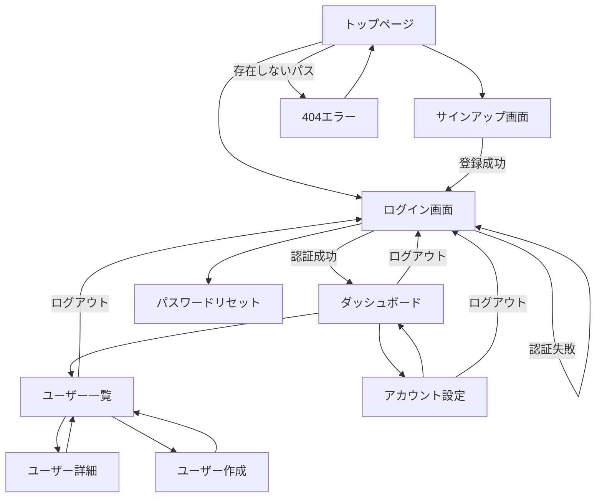

# 画面設計

<!--
何を書くか: 画面一覧、画面の役割、画面遷移フロー

目的:
  - 画面の全体像を把握
  - 画面ごとの責務を明確化
  - ユーザーの導線を可視化
  - 画面追加・削除の記録

重要性:
  - 画面構成の全体像を共有
  - UX設計の基盤
  - 画面間の整合性確認
  - 実装前の手戻り防止

記載のポイント:
  - 画面IDで一意に識別
  - 画面の目的を簡潔に記載
  - Mermaid図で遷移フローを可視化
  - 詳細な実装仕様はコードとStorybookに委ねる

更新頻度:
  - プロジェクト初期に画面設計時
  - 画面追加・削除時に更新
  - 画面遷移変更時に更新

**単一情報源（Single Source of Truth）の原則**:
  - このドキュメント: 画面構成と遷移フロー（高レベル、変更頻度低）
  - コード: UIコンポーネント、フォーム仕様、バリデーション（詳細、変更頻度高）
  - Storybook: コンポーネントカタログ、Props仕様
  - Figma: デザインモック、ビジュアルデザイン
-->

---

## 画面一覧

<!--
システム内の全画面を一覧化

**画面は動的**: 現代のWebアプリケーションでは、画面表示はユーザーデータやシステム状態に
強く依存します。同じ画面でも、データの有無や権限により全く異なる見た目・振る舞いになります。

テーブル構成:
【画面ID】
  - 一意の識別子（例: SCR-001, SCR-002）
  - 実装ファイル名やURLパスと紐付けると管理しやすい

【画面名】
  - ユーザーに表示される画面の名前
  - 日本語の正式名称

【役割・目的】
  - その画面が存在する理由
  - ユーザーがこの画面で何を達成するか
  - 簡潔に1-2文で記載

【アクセス権限】
  - 誰がこの画面にアクセスできるか
  - 例: 全ユーザー、認証済みユーザー、管理者のみ

【考慮すべき状態・Empty State】
  - 画面がとりうる主要な状態バリエーションを記載
  - 特にEmpty State（データがない状態）は開発時に忘れられがちなので明示
  - 各状態での表示内容やCTA（Call To Action）を簡潔に記載

  よくある状態パターン:
  1. 初回訪問（First Use）
     - まだデータが作成されていない
     - CTA: 「最初の〜を作成」ボタン、チュートリアル

  2. 通常状態（Normal）
     - データが存在する通常の状態
     - リスト表示、データ表示

  3. 検索・フィルタ結果なし（No Results）
     - 検索条件やフィルタに一致するデータがない
     - CTA: 「検索条件をクリア」リンク、「フィルタをリセット」

  4. エラー状態（Error）
     - データ読み込み失敗、ネットワークエラー
     - CTA: 「再試行」ボタン

  5. ローディング状態（Loading）
     - データ取得中
     - スケルトンスクリーン、スピナー

  記載のポイント:
  - 主要な状態のみ記載（詳細はコードに委ねる）
  - Empty StateのCTAは必ず明記（ユーザーの次のアクションを明確に）
  - メッセージ文言やイラストの詳細は不要（コード・Figmaに委ねる）

【備考】
  - 特記事項（オプション）
  - デザインモックへのリンク
  - 実装状況（実装済み/未実装）

記載のベストプラクティス:
  - 全画面を網羅（エラー画面、管理画面も含む）
  - 役割は簡潔に（詳細はコードに委ねる）
  - カテゴリごとにグループ化すると見やすい
  - Empty Stateを意識的にチェック（忘れがちなので）

よくある画面分類:
  - 認証系: ログイン、サインアップ、パスワードリセット
  - メイン機能: ダッシュボード、一覧、詳細、作成、編集
  - 設定系: ユーザー設定、アカウント設定
  - エラー系: 404, 500, 権限エラー
  - 管理系: 管理ダッシュボード、ユーザー管理
-->

### 認証関連

| 画面ID | 画面名 | 役割・目的 | アクセス権限 | 考慮すべき状態・Empty State |
|--------|--------|-----------|--------------|---------------------------|
| <!-- SCR-001 --> | <!-- ログイン画面 --> | <!-- ユーザー認証を行い、システムにアクセスできるようにする --> | <!-- 未認証ユーザー --> | <!-- 通常状態：フォーム表示<br/>エラー状態：認証失敗メッセージ、「再試行」 --> |
| <!-- SCR-002 --> | <!-- サインアップ画面 --> | <!-- 新規ユーザーがアカウントを作成する --> | <!-- 未認証ユーザー --> | <!-- 通常状態：フォーム表示<br/>エラー状態：バリデーションエラー、既存ユーザーエラー --> |
| <!-- SCR-003 --> | <!-- パスワードリセット画面 --> | <!-- パスワードを忘れたユーザーがパスワードを再設定する --> | <!-- 未認証ユーザー --> | <!-- 通常状態：メール送信フォーム<br/>成功状態：「メールを送信しました」確認画面 --> |

### メイン機能

| 画面ID | 画面名 | 役割・目的 | アクセス権限 | 考慮すべき状態・Empty State |
|--------|--------|-----------|--------------|---------------------------|
| <!-- SCR-010 --> | <!-- ダッシュボード --> | <!-- システム全体の概要と主要メトリクスを表示し、各機能へのエントリーポイントを提供 --> | <!-- 認証済みユーザー --> | <!-- 初回訪問：データなし、「最初のプロジェクトを作成」CTA<br/>通常状態：メトリクス・グラフ表示<br/>ローディング状態：スケルトンスクリーン --> |
| <!-- SCR-011 --> | <!-- ユーザー一覧 --> | <!-- 登録ユーザーを一覧表示し、検索・フィルタリング機能を提供 --> | <!-- 管理者 --> | <!-- 初回訪問：ユーザーなし、「ユーザーを招待」CTA<br/>検索結果なし：「検索条件をクリア」リンク<br/>フィルタ結果なし：「フィルタをリセット」リンク<br/>通常状態：ユーザーリスト表示 --> |
| <!-- SCR-012 --> | <!-- ユーザー詳細 --> | <!-- 特定ユーザーの情報を表示・編集する --> | <!-- 本人または管理者 --> | <!-- 通常状態：ユーザー情報表示<br/>エラー状態：ユーザー不存在（削除済み）、「ユーザー一覧に戻る」CTA<br/>ローディング状態：スケルトンスクリーン --> |
| <!-- SCR-013 --> | <!-- ユーザー作成 --> | <!-- 新しいユーザーを作成する --> | <!-- 管理者 --> | <!-- 通常状態：作成フォーム表示<br/>エラー状態：バリデーションエラー、重複エラー --> |

### 設定関連

| 画面ID | 画面名 | 役割・目的 | アクセス権限 | 考慮すべき状態・Empty State |
|--------|--------|-----------|--------------|---------------------------|
| <!-- SCR-020 --> | <!-- アカウント設定 --> | <!-- ユーザーが自分のアカウント情報を編集する --> | <!-- 認証済みユーザー --> | <!-- 通常状態：自分の情報が常に存在<br/>ローディング状態：スケルトンスクリーン<br/>エラー状態：保存失敗、「再試行」 --> |
| <!-- SCR-021 --> | <!-- システム設定 --> | <!-- システム全体の設定を管理する --> | <!-- 管理者 --> | <!-- 通常状態：設定値表示<br/>初回訪問：デフォルト値表示、「設定を保存」CTA<br/>エラー状態：保存失敗 --> |

### エラー画面

| 画面ID | 画面名 | 役割・目的 | アクセス権限 | 考慮すべき状態・Empty State |
|--------|--------|-----------|--------------|---------------------------|
| <!-- SCR-900 --> | <!-- 404 Not Found --> | <!-- 存在しないページへのアクセス時にエラーを表示し、トップページへの導線を提供 --> | <!-- 全ユーザー --> | <!-- エラー状態：常にこの状態<br/>CTA：「トップページに戻る」「検索」 --> |
| <!-- SCR-901 --> | <!-- 500 Server Error --> | <!-- サーバーエラー発生時にエラーを表示 --> | <!-- 全ユーザー --> | <!-- エラー状態：常にこの状態<br/>CTA：「再試行」「サポートに連絡」 --> |
| <!-- SCR-902 --> | <!-- 403 Forbidden --> | <!-- 権限不足でアクセスできない場合にエラーを表示 --> | <!-- 全ユーザー --> | <!-- エラー状態：常にこの状態<br/>CTA：「ログイン」「ダッシュボードに戻る」 --> |

---

## 画面遷移図

<!--
画面間の遷移フローをMermaid図で可視化

目的:
  - ユーザーの導線を明確化
  - 画面間の関係性を理解
  - デッドエンド（戻れない画面）の検出
  - 認証フローの可視化

記載のベストプラクティス:
  1. 主要な遷移フローを記載（全ての遷移を書くと複雑すぎる）
  2. 認証前/後でグループ化
  3. 遷移条件をラベルで記載（例: ログイン成功、エラー時）
  4. 複雑な場合は複数の図に分割

Mermaidの記法:
  - flowchart TD: 上から下へのフロー
  - flowchart LR: 左から右へのフロー
  - A[画面名] --> B[画面名]: 遷移
  - A --> |条件| B: 条件付き遷移

よくあるパターン:
  - 未認証 → ログイン → ダッシュボード → 各機能画面
  - エラー画面 → トップページ
  - 管理画面は別フローで記載
-->



**補足**:
<!-- 例:
- ログイン画面からのOAuth認証フローは省略
- 管理者専用画面の遷移は「管理機能遷移図」を参照
- モバイル版は一部遷移が異なる（タブナビゲーション）
- 詳細な条件分岐はコードを参照
-->

---

## 画面カテゴリ・役割

<!--
画面をカテゴリごとに整理し、各カテゴリの役割を明確化（オプション）

このセクションは画面数が多い場合に有用。
画面一覧テーブルで十分な場合は省略可能。

記載すべき内容:
  - カテゴリ名（認証、メイン機能、管理、設定など）
  - カテゴリの役割・責務
  - 含まれる画面の一覧
  - 特記事項
-->

### 認証関連画面

**役割**: ユーザーの認証・認可を管理し、システムへの安全なアクセスを提供

**含まれる画面**:
- ログイン画面（SCR-001）
- サインアップ画面（SCR-002）
- パスワードリセット画面（SCR-003）

**特記事項**:
<!-- 例:
- OAuth 2.0（Google, GitHub）による認証も対応
- 二段階認証は今後実装予定
-->

---

### メイン機能画面

**役割**: システムの主要な業務機能を提供

**含まれる画面**:
- ダッシュボード（SCR-010）
- ユーザー一覧（SCR-011）
- ユーザー詳細（SCR-012）
- ユーザー作成（SCR-013）

**特記事項**:
<!-- 例:
- CRUD操作の標準パターンを採用
- 一覧画面は検索・フィルタ・ソート・ページネーション機能を標準装備
-->

---

## レスポンシブデザインポリシー

<!--
何を書くか: 様々なデバイス・画面サイズへの対応方針

目的:
  - デバイス対応の方針を明確化
  - ブレークポイントの統一
  - 実装時の判断基準の提供
  - QAテスト時の確認項目の明確化

重要性:
  - スマートフォン、タブレット、PCでの一貫したUX
  - 実装の手戻り防止
  - デザインとエンジニアリングの認識統一
  - アクセシビリティ向上

記載のポイント:
  - プロジェクト全体で統一されたブレークポイント定義
  - デバイスごとの対応優先度
  - 主要なレイアウトパターン
  - 画像・メディアの最適化方針
  - タッチインタラクションの考慮

更新頻度:
  - プロジェクト初期にポリシー策定
  - デバイス対応範囲変更時に更新
  - ブレークポイント変更時に更新（稀）
-->

### ブレークポイント定義

<!--
何を書くか: CSS/JSで使用するブレークポイントの定義

よくあるブレークポイント戦略:
  A. モバイルファースト（推奨）
     - 最小画面から設計し、徐々に大画面に対応
     - min-width を使用
     - パフォーマンス上有利（モバイルが軽量）

  B. デスクトップファースト
     - デスクトップから設計し、徐々に小画面に対応
     - max-width を使用
     - 既存デスクトップサイトの改修時に採用

記載のベストプラクティス:
  - プロジェクト全体で統一された値を使用
  - CSS変数やデザイントークンとして管理
  - デバイス名ではなく画面サイズで定義（"iPhone"ではなく"sm"）
  - 主要デバイスの実解像度を考慮
-->

| ブレークポイント | 画面幅 | 対象デバイス | 用途 |
|-----------------|--------|-------------|------|
| **xs** (Extra Small) | `< 640px` | スマートフォン（縦） | 最小画面、1カラムレイアウト |
| **sm** (Small) | `≥ 640px` | スマートフォン（横）、小型タブレット | 2カラム可能 |
| **md** (Medium) | `≥ 768px` | タブレット（縦） | サイドバー表示開始 |
| **lg** (Large) | `≥ 1024px` | タブレット（横）、小型ノートPC | 複雑なレイアウト可能 |
| **xl** (Extra Large) | `≥ 1280px` | デスクトップ、ノートPC | フル機能表示 |
| **2xl** (2X Large) | `≥ 1536px` | 大型デスクトップ、4Kモニター | 最大コンテンツ幅制限 |

**実装例（Tailwind CSS形式）**:
```css
/* tailwind.config.js */
module.exports = {
  theme: {
    screens: {
      'sm': '640px',
      'md': '768px',
      'lg': '1024px',
      'xl': '1280px',
      '2xl': '1536px',
    }
  }
}
```

**CSS変数での実装例**:
```css
:root {
  --breakpoint-sm: 640px;
  --breakpoint-md: 768px;
  --breakpoint-lg: 1024px;
  --breakpoint-xl: 1280px;
  --breakpoint-2xl: 1536px;
}
```

---

### デバイス対応方針

<!--
何を書くか: どのデバイスを優先して対応するか

記載のポイント:
  - 対応優先度（必須/推奨/検討中/対応外）
  - ターゲットユーザーのデバイス利用状況
  - アナリティクスデータがあれば参照
  - テスト対象デバイスの明確化
-->

| デバイスカテゴリ | 対応優先度 | 画面幅範囲 | 備考 |
|----------------|-----------|-----------|------|
| **スマートフォン** | 必須 | 320px - 640px | iPhone SE (375px) 以上を最優先 |
| **タブレット** | 推奨 | 640px - 1024px | iPad (768px, 1024px) でテスト |
| **ノートPC / デスクトップ** | 必須 | 1024px - 1920px | 1366px, 1920px を重点テスト |
| **大型モニター (4K)** | 検討中 | 1920px 以上 | コンテンツ最大幅で制限 (max-width: 1536px) |

**モバイルファースト戦略を採用**:
- デザイン・実装はスマートフォン画面から開始
- 段階的にタブレット、デスクトップに対応
- パフォーマンス最適化をモバイル基準で実施

---

### レイアウトパターン

<!--
何を書くか: 画面サイズごとの主要なレイアウトパターン

よくあるパターン:
  1. カラム数の変更
     - モバイル: 1カラム
     - タブレット: 2カラム
     - デスクトップ: 3-4カラム

  2. ナビゲーションの変更
     - モバイル: ハンバーガーメニュー
     - タブレット: タブバー
     - デスクトップ: サイドバー

  3. コンテンツの表示/非表示
     - モバイル: 必須情報のみ、詳細は折りたたみ
     - デスクトップ: 全情報表示

  4. モーダルとドロワー
     - モバイル: ボトムシート、フルスクリーンモーダル
     - デスクトップ: センターモーダル
-->

#### ナビゲーション

| デバイス | パターン | 説明 |
|---------|---------|------|
| **モバイル (xs - sm)** | ハンバーガーメニュー + ボトムナビゲーション | 上部にハンバーガーメニュー、下部に主要4-5項目のタブバー |
| **タブレット (md)** | サイドドロワー | スワイプで開閉可能なサイドメニュー |
| **デスクトップ (lg+)** | 固定サイドバー | 常時表示される左サイドバーナビゲーション |

#### コンテンツレイアウト

| 画面要素 | モバイル (xs) | タブレット (md) | デスクトップ (lg+) |
|---------|-------------|----------------|------------------|
| **カラム数** | 1カラム | 2カラム | 3-4カラム |
| **サイドバー** | 非表示（ドロワー） | 折りたたみ可能 | 常時表示 |
| **カード一覧** | 縦積み | 2列グリッド | 3-4列グリッド |
| **フォーム** | 縦積み | 2列可能 | 2列推奨 |
| **テーブル** | 横スクロール or カード形式 | 横スクロール | フル表示 |

---

### 画像・メディア対応

<!--
何を書くか: 画像やメディアの最適化方針

記載のポイント:
  - レスポンシブ画像の提供方法
  - 画像フォーマット（WebP, AVIF）
  - 遅延ローディング
  - アスペクト比の維持
-->

| 項目 | 方針 | 実装方法 |
|------|------|---------|
| **レスポンシブ画像** | デバイスに応じて最適なサイズを配信 | `srcset` と `sizes` 属性使用、または Next.js Image コンポーネント |
| **画像フォーマット** | 最新フォーマット優先、フォールバック提供 | WebP/AVIF → JPEG/PNG の順で配信（`<picture>` 要素） |
| **遅延ローディング** | ファーストビュー外の画像は遅延読み込み | `loading="lazy"` 属性、Intersection Observer |
| **アスペクト比** | レイアウトシフト防止のため事前確保 | `aspect-ratio` CSS プロパティ |
| **動画** | モバイルは自動再生オフ、データ通信量考慮 | `preload="metadata"`, 解像度別エンコード |

**実装例**:
```html
<picture>
  <source srcset="image.avif" type="image/avif">
  <source srcset="image.webp" type="image/webp">
  
</picture>
```

---

### タッチインタラクション

<!--
何を書くか: タッチデバイスでのインタラクション設計

記載のポイント:
  - タップターゲットサイズ（最小44x44px推奨）
  - ジェスチャー対応（スワイプ、ピンチズーム）
  - ホバー効果の代替（タッチデバイスにはホバーがない）
  - タップ時のフィードバック
-->

| 項目 | ガイドライン | 理由 |
|------|------------|------|
| **タップターゲットサイズ** | 最小 44x44px (推奨 48x48px) | タップしやすさ、アクセシビリティ（WCAG準拠） |
| **要素間の余白** | 最小 8px | 誤タップ防止 |
| **ホバー効果** | タッチデバイスでは `:active` を使用 | `:hover` はタッチ後に残留する問題あり |
| **スワイプジェスチャー** | カルーセル、ドロワー開閉で活用 | ネイティブアプリに近い操作感 |
| **長押し** | コンテキストメニュー表示に使用可能 | ただし発見可能性が低いため必須操作には使わない |
| **ピンチズーム** | 画像ギャラリーで有効化 | `user-scalable=yes` を設定 |

**アクセシブルなボタン実装例**:
```css
.button {
  min-width: 44px;
  min-height: 44px;
  padding: 12px 24px;
  /* タップ時の視覚的フィードバック */
  transition: background-color 0.15s;
}

.button:active {
  background-color: var(--color-primary-dark);
  transform: scale(0.98);
}
```

---

### パフォーマンス考慮事項

<!--
何を書くか: レスポンシブ対応におけるパフォーマンス最適化

記載のポイント:
  - モバイルネットワーク環境への配慮
  - バンドルサイズの最適化
  - リソース読み込み優先順位
  - Core Web Vitals 目標値
-->

| 項目 | 目標値 | 施策 |
|------|-------|------|
| **LCP (Largest Contentful Paint)** | < 2.5秒 | 画像最適化、フォント最適化、SSR/SSG活用 |
| **FID (First Input Delay)** | < 100ms | JavaScript 分割ロード、メインスレッド負荷軽減 |
| **CLS (Cumulative Layout Shift)** | < 0.1 | 画像・広告サイズ事前確保、フォント読み込み最適化 |
| **バンドルサイズ** | 初回 < 200KB (gzip圧縮後) | コード分割、Tree Shaking、不要なライブラリ削除 |
| **TTI (Time to Interactive)** | < 3.5秒（3G回線） | Critical CSS インライン化、遅延ローディング |

**モバイルネットワーク対応**:
- 3G回線でのテストを実施（Chrome DevTools のネットワークスロットリング使用）
- オフライン時の適切なフォールバック表示
- プログレッシブWebアプリ（PWA）化を検討

---

## デザイン参考資料

<!--
デザインモックやスタイルガイドへのリンク（オプション）

詳細な実装仕様はここには記載せず、外部リソースへのリンクのみ記載。
これにより、ドキュメントの保守負担を軽減し、常に最新の情報を参照できる。

リンクすべきリソース:
  - Figma/Adobe XD/Sketch プロジェクト
  - Storybook（コンポーネントカタログ）
  - デザインシステムドキュメント
  - ワイヤーフレーム
  - ユーザビリティテスト結果
-->

| リソース | URL | 説明 |
|---------|-----|------|
| **Figmaデザイン** | <!-- https://figma.com/file/... --> | <!-- 全画面のデザインモック（レスポンシブ対応含む） --> |
| **Storybook** | <!-- https://storybook.example.com --> | <!-- UIコンポーネントカタログ（各ブレークポイントで表示確認可能） --> |
| **デザインシステム** | <!-- https://design.example.com --> | <!-- カラー、タイポグラフィ、コンポーネント仕様、レスポンシブガイドライン --> |
| **レスポンシブテスト** | <!-- https://browserstack.com/project/... --> | <!-- 実機テスト結果（BrowserStack / Sauce Labs） --> |

---

## メモ

<!--
画面設計に関する補足情報

記載すべき内容:
  1. 設計の経緯・背景
     - なぜこの画面構成にしたか
     - ユーザーリサーチの結果
     - 競合分析の結果

  2. 将来の変更予定
     - 追加予定の画面
     - リデザイン計画
     - 段階的リリースの計画

  3. 技術的制約
     - レスポンシブ対応の方針
     - ブラウザサポート範囲
     - アクセシビリティ対応（WCAG準拠レベル）

  4. 既知の問題・改善予定
     - UX上の課題
     - ユーザーフィードバック
     - 改善予定事項

  5. 参考資料
     - ワイヤーフレーム作成時の参考サイト
     - デザインパターンライブラリ
     - UXリサーチ資料
-->
