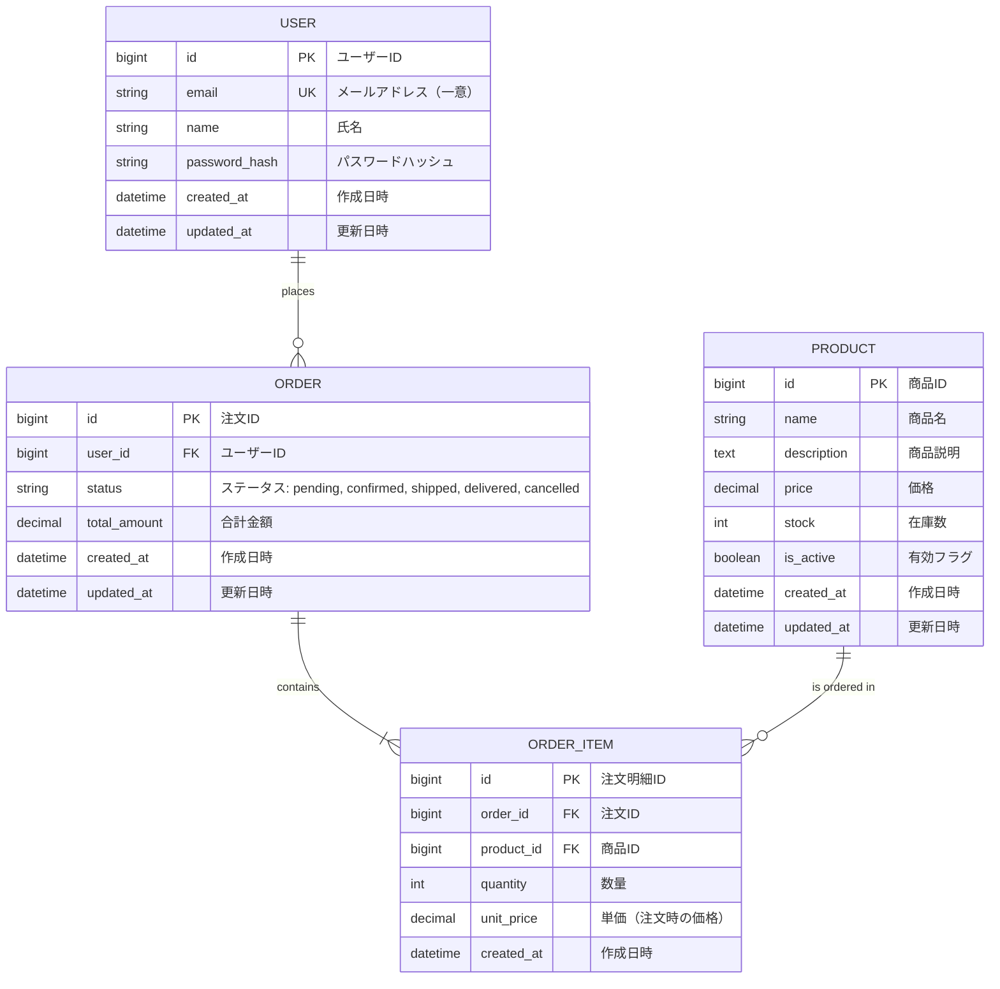

# データモデル（ERD）

<!--
何を書くか: データベース構造、エンティティ、属性、リレーションシップ、制約

目的:
  - データ構造の全体像を可視化
  - テーブル設計の一貫性を保つ
  - 開発者間の認識統一
  - データの整合性ルールを明確化
  - マイグレーション計画の基盤

重要性:
  - データベース設計の記録（ADR: Architecture Decision Record の一部）
  - 正規化・非正規化の判断根拠を記録
  - パフォーマンス最適化の指針
  - データ整合性の担保
  - 将来の拡張性を考慮した設計

記載のポイント:
  - Mermaid ERD で視覚的に表現
  - エンティティごとに責務を明確化
  - リレーションシップと多重度を正確に記載
  - 制約（NOT NULL, UNIQUE, CHECK）を明記
  - インデックス戦略を記録
  - データ型の選択理由を記載

更新頻度:
  - プロジェクト初期にドメインモデルから作成
  - テーブル追加・変更時に更新
  - マイグレーション実行時に更新
  - パフォーマンスチューニング時に見直し
-->

---

## エンティティ一覧

<!--
各エンティティの責務と主要属性を明記

まずエンティティの一覧を把握してから、ERDで視覚化する流れが自然です。

テーブル構成:
【エンティティ名】
  - テーブル名（物理名）
  - 複数形推奨（例: users, orders, products）
  - スネークケース推奨（例: order_items, user_roles）

【説明】
  - そのエンティティが表現するビジネス概念
  - 責務と役割
  - ドメインモデルとの対応

【主要属性】
  - 重要なカラムをリスト化
  - すべてを列挙する必要はない（詳細は ERD 参照）
  - ビジネスキーとなる属性を優先的に記載

【備考】
  - 正規化・非正規化の判断理由
  - パーティショニング戦略
  - 削除方法（論理削除 or 物理削除）
  - 監査要件（作成日時、更新日時、削除日時）

記載のベストプラクティス:
  - エンティティの分類を明記（コア、参照、関連、履歴）
  - ソフトデリート（論理削除）の有無を記載
  - タイムスタンプ（created_at, updated_at）の有無
  - ドメインモデルの Aggregate との対応を記載

よくあるエンティティの分類:
  - コアエンティティ: ビジネスの中心（User, Order, Product）
  - 参照エンティティ: マスタデータ（Category, Status, Country）
  - 関連エンティティ: 多対多の中間テーブル（UserRole, OrderItem）
  - 履歴エンティティ: 監査ログ、変更履歴（AuditLog, OrderHistory）
-->

| エンティティ名 | 説明 | 主要属性 | 備考 |
|---------------|------|----------|------|
| <!-- 例: users --> | <!-- 例: ユーザー情報を管理。システムにアクセスする全てのユーザーを表す --> | <!-- 例: id, email, name, password_hash --> | <!-- 例: 論理削除（deleted_at）、email は一意制約 --> |
| <!-- 例: orders --> | <!-- 例: 注文情報を管理。ユーザーが商品を購入する取引単位 --> | <!-- 例: id, user_id, status, total_amount --> | <!-- 例: status は enum 型または CHECK 制約、物理削除不可（履歴保持） --> |
| <!-- 例: products --> | <!-- 例: 商品マスタ。販売可能な商品の情報を管理 --> | <!-- 例: id, name, price, stock --> | <!-- 例: 論理削除（is_active）、在庫数は別テーブルでも可 --> |
| <!-- 例: order_items --> | <!-- 例: 注文明細。注文に含まれる商品と数量を管理 --> | <!-- 例: id, order_id, product_id, quantity, unit_price --> | <!-- 例: 価格変更の影響を避けるため unit_price を保持 --> |

---

## リレーションシップ

<!--
エンティティ間の関係性を明記

エンティティ一覧で各テーブルの責務を把握した後、このセクションでテーブル間の関係性を理解します。
その後、ERDで視覚的に確認する流れが自然です。

テーブル構成:
【エンティティA / エンティティB】
  - リレーションシップの両端のエンティティ名

【関係性】
  - 多重度を記載
  - 1:1（一対一）
  - 1:N（一対多）
  - N:M（多対多） → 通常は中間テーブルで 1:N + N:1 に分解

【外部キー】
  - FK として使用されるカラム名
  - 命名規則: {参照先テーブル名}_id（例: user_id, product_id）

【制約】
  - ON DELETE の動作（CASCADE, SET NULL, RESTRICT）
  - ON UPDATE の動作
  - NOT NULL 制約の有無

【備考】
  - ビジネスルールの説明
  - リレーションシップの意味
  - インデックスの有無

記載のベストプラクティス:
  - 親子関係を明確に
  - CASCADE 削除は慎重に（意図しないデータ削除を防ぐ）
  - 循環参照に注意
  - パフォーマンスを考慮した FK インデックス
-->

| エンティティA | エンティティB | 関係性 | 外部キー | 制約 | 備考 |
|--------------|--------------|--------|----------|------|------|
| <!-- 例: users --> | <!-- 例: orders --> | <!-- 例: 1:N --> | <!-- 例: user_id --> | <!-- 例: ON DELETE RESTRICT --> | <!-- 例: 1人のユーザーが複数の注文を持つ。ユーザー削除時は注文が残るため RESTRICT --> |
| <!-- 例: orders --> | <!-- 例: order_items --> | <!-- 例: 1:N --> | <!-- 例: order_id --> | <!-- 例: ON DELETE CASCADE --> | <!-- 例: 1つの注文が複数の明細を持つ。注文削除時は明細も削除 --> |
| <!-- 例: products --> | <!-- 例: order_items --> | <!-- 例: 1:N --> | <!-- 例: product_id --> | <!-- 例: ON DELETE RESTRICT --> | <!-- 例: 商品削除時は注文明細が残るため削除不可 --> |

---

## ERD（Entity Relationship Diagram）

<!--
Mermaid を使用してデータベース構造を可視化

エンティティ一覧とリレーションシップで理解した内容を、このERDで視覚的に確認します。

記載のベストプラクティス:
  1. すべてのエンティティとリレーションシップを記載
  2. 主キー（PK）、外部キー（FK）を明記
  3. データ型を記載（int, string, datetime, boolean など）
  4. リレーションシップの多重度を正確に表現（1:1, 1:N, N:M）
  5. 複雑な場合は複数の図に分割（コアドメイン、サブドメインごと）

Mermaid ERD の記法:
  - エンティティ名 { 属性名 データ型 制約 }
  - リレーションシップ記法:
    - ||--|| : 1対1（必須-必須）
    - ||--o| : 1対0..1（必須-オプション）
    - ||--o{ : 1対多（必須-0以上）
    - }o--o{ : 多対多
  - PK: Primary Key（主キー）
  - FK: Foreign Key（外部キー）
  - UK: Unique Key（一意制約）
-->

**補足**:
<!-- 例:
- USER と ORDER は 1:N の関係（1人のユーザーが複数の注文を持つ）
- ORDER と ORDER_ITEM は 1:N の関係（1つの注文が複数の明細を持つ）
- PRODUCT と ORDER_ITEM は 1:N の関係（1つの商品が複数の注文明細に含まれる）
- unit_price を ORDER_ITEM に持たせることで、価格変更の影響を回避
-->
