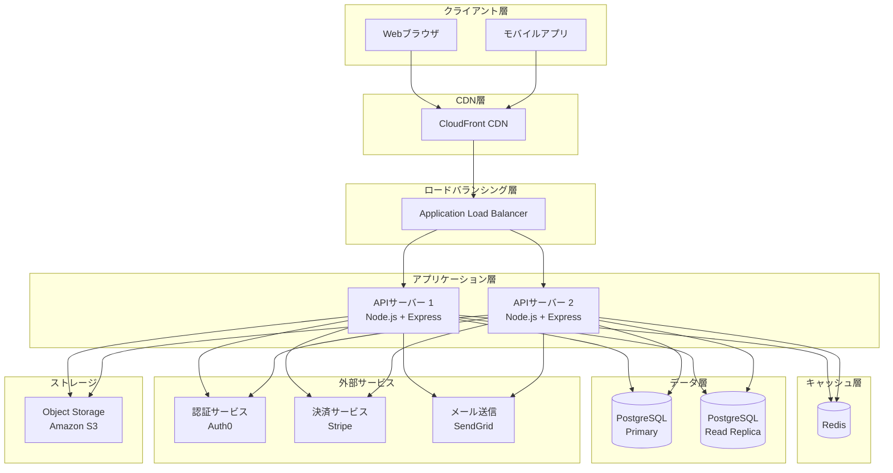

# アーキテクチャ設計

<!--
何を書くか: システム全体の構造、採用アーキテクチャパターン、重要な設計決定（ADR）

目的:
  - システム全体の見通しを向上
  - コンポーネント間の関係を明確化
  - アーキテクチャ決定の記録と共有

重要性:
  - 高レベルなアーキテクチャの全体像を把握
  - 詳細な実装仕様（スペック、パフォーマンス数値）はコードとインフラコードで管理

記載のポイント:
  - システムアーキテクチャ図で視覚的に表現
  - 採用したアーキテクチャパターンとその理由
  - 重要な技術的決定事項（ADR）

更新頻度:
  - プロジェクト初期にアーキテクチャ設計を作成
  - アーキテクチャ変更時に更新
  - 重要な技術的決定時に ADR を追加
-->

---

## システムアーキテクチャ図

<!--
Mermaid を使用してシステム全体の構造を可視化

記載のベストプラクティス:
  1. 主要なコンポーネントとその関係を記載
  2. データフローを矢印で表現
  3. 外部システムとの連携も記載
  4. レイヤーごとに色分けまたはグループ化
  5. 複雑な場合は複数の図に分割（全体図、詳細図）

よくあるコンポーネント:
  - クライアント層: Webブラウザ、モバイルアプリ
  - プレゼンテーション層: フロントエンド（React, Vue）
  - API層: REST API, GraphQL
  - ビジネスロジック層: サービス、ドメインモデル
  - データアクセス層: ORM、リポジトリ
  - データストア層: RDBMS, NoSQL, キャッシュ
  - 外部サービス: 決済API、メール送信、認証サービス
  - インフラ: ロードバランサー、CDN、キューシステム

Mermaid の記法:
  - graph TD: 上から下へのフロー
  - graph LR: 左から右へのフロー
  - subgraph でグループ化
  - []: 四角、(): 丸角四角、{}: ひし形、[()]: スタジアム型、[[]]: サブルーチン、[()]: 円柱
-->

**補足**:
<!-- 例:
- クライアントからのリクエストは CDN を経由してキャッシュ可能な静的コンテンツを配信
- API層は水平スケール可能（オートスケーリング）
- データベースは Primary/Replica 構成で読み取り負荷を分散
- Redis でセッション管理とキャッシュを実現
- 外部サービスとの連携は API Gateway 経由で統一
-->

---

## 採用アーキテクチャパターン

<!--
採用したアーキテクチャパターンとその理由を簡潔に記載

よくあるアーキテクチャパターン:
  - Layered Architecture: プレゼンテーション層 → ビジネスロジック層 → データアクセス層
  - Clean Architecture: ドメイン中心、依存性逆転
  - Microservices: サービスごとに独立したデプロイ
  - Event-Driven: 非同期処理、疎結合

記載すべき内容:
  - 採用パターン名
  - 選定理由（なぜこのパターンが適しているか）
  - 適用範囲
-->

| 項目 | 内容 |
|------|------|
| **採用パターン** | <!-- 例: Layered Architecture（レイヤードアーキテクチャ） --> |
| **選定理由** | <!-- 例: チームサイズが小規模なため、シンプルで運用コストの低いアーキテクチャを選択 --> |
| **適用範囲** | <!-- 例: バックエンド全体 --> |

---

## ADR（Architecture Decision Record）

<!--
重要なアーキテクチャ決定を記録

ADR とは:
  - アーキテクチャに関する重要な決定を記録
  - 「なぜその決定をしたか」の背景を残す
  - 将来的な見直しや移行の判断材料

記載すべき内容:
  - 決定事項: 何を決めたか
  - 背景: なぜその決定が必要だったか
  - 代替案: 他の選択肢
  - 影響: その決定による影響
  - 決定日: いつ決定したか

よくある決定事項:
  - データベースの選択
  - キャッシュ戦略
  - 認証方式
  - デプロイ戦略
-->

| 決定事項 | 背景 | 代替案 | 影響 | 決定日 |
|---------|------|--------|------|--------|
| <!-- 例: PostgreSQL を採用 --> | <!-- 例: ACID準拠のトランザクションが必要 --> | <!-- 例: MySQL, MongoDB --> | <!-- 例: データ整合性が高い --> | <!-- 例: 2024-01-05 --> |
| <!-- 例: Redis をセッション管理に使用 --> | <!-- 例: ステートレスな API サーバーを実現 --> | <!-- 例: DB保存, JWT のみ --> | <!-- 例: セッション管理が高速 --> | <!-- 例: 2024-01-10 --> |
