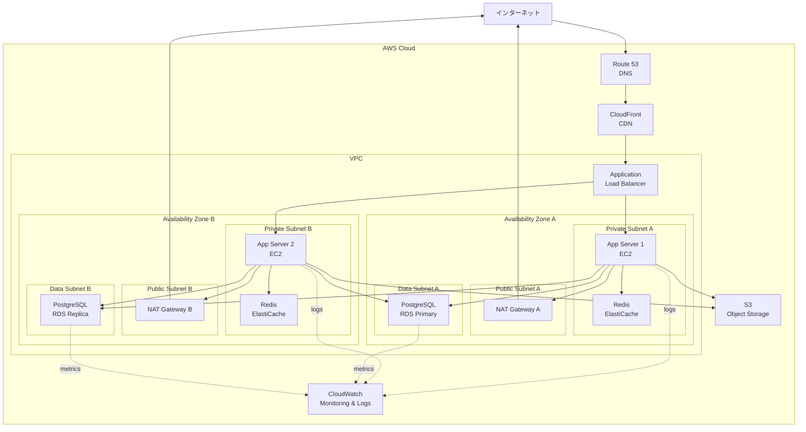

# インフラ設計

<!--
何を書くか: インフラ構成図、環境構成、主要な運用方針

目的:
  - インフラ構成の全体像を可視化
  - 環境ごとの違いを明確化
  - 基本的な運用方針の記録

重要性:
  - 高レベルなインフラ構成の全体像を把握
  - 詳細な実装（スペック、ネットワーク設定、監視設定）は Infrastructure as Code で管理

記載のポイント:
  - インフラ構成図で視覚的に表現（Multi-AZ構成など）
  - 環境ごとの違い（開発、ステージング、本番）
  - バックアップ・監視の基本方針

更新頻度:
  - プロジェクト初期にインフラ設計を作成
  - インフラ構成変更時に更新
-->

---

## インフラ構成図

<!--
Mermaid を使用してインフラ全体の構成を可視化

記載のベストプラクティス:
  1. 物理的な構成を表現（サーバー、ネットワーク、ストレージ）
  2. 冗長化構成を明記（Multi-AZ、フェイルオーバー）
  3. ネットワークセグメントを分離（パブリック、プライベート、DMZ）
  4. セキュリティグループ、ファイアウォールルールを図示
  5. 外部サービスとの接続も記載

よくあるコンポーネント:
  - インターネット: 外部ネットワーク
  - CDN: CloudFront, Cloudflare, Fastly
  - DNS: Route 53, Cloudflare DNS
  - Load Balancer: ALB, NLB, ELB
  - アプリケーションサーバー: EC2, ECS, Lambda
  - データベース: RDS, Aurora, DynamoDB
  - キャッシュ: ElastiCache (Redis, Memcached)
  - ストレージ: S3, EBS, EFS
  - VPN: VPC Peering, VPN Gateway
  - 監視: CloudWatch, Datadog, New Relic

Mermaid の記法:
  - subgraph でネットワークセグメントをグループ化
  - VPC, Subnet, Availability Zone を表現
-->

**補足**:
<!-- 例:
- Multi-AZ 構成で可用性を確保（AZ-A と AZ-B で冗長化）
- Public Subnet: インターネットゲートウェイへの経路あり（NAT Gateway）
- Private Subnet: アプリケーションサーバー（外部から直接アクセス不可）
- Data Subnet: データベース（Private Subnet からのみアクセス可能）
- RDS は Primary と Read Replica で読み取り負荷を分散
- Redis は各 AZ に配置しレプリケーション構成
- CloudWatch で全リソースの監視とログ集約
-->

---

## 環境構成

<!--
開発、ステージング、本番環境の違いを明記

環境ごとの特徴:
  - 開発環境: ローカル開発、最小構成
  - ステージング環境: 本番に近い構成、テスト用
  - 本番環境: 高可用性、冗長化構成

詳細なスペック（インスタンスタイプ、ストレージ容量など）は
Infrastructure as Code（Terraform/CloudFormation）で管理します。
-->

| 環境 | ホスティング | データベース | 特徴 |
|------|-------------|-------------|------|
| **開発** | <!-- ローカル（Docker） --> | <!-- PostgreSQL (Docker) --> | <!-- 最小構成、コスト最小化 --> |
| **ステージング** | <!-- AWS EC2 --> | <!-- RDS PostgreSQL Single-AZ --> | <!-- 本番に近い構成だが小規模 --> |
| **本番** | <!-- AWS EC2 Auto Scaling --> | <!-- RDS PostgreSQL Multi-AZ + Read Replica --> | <!-- Multi-AZ 冗長化、高可用性 --> |

---

## 主要な運用方針

<!--
バックアップ、監視、セキュリティの基本方針を簡潔に記載

詳細な設定（監視閾値、ログ設定、ネットワーク設定など）は
Infrastructure as Code とランブックで管理します。

記載すべき内容:
  - バックアップ方針
  - 監視方針
  - セキュリティ基本方針
-->

| 項目 | 内容 |
|------|------|
| **バックアップ** | <!-- 例: RDS 日次自動バックアップ（30日保持）、S3 バージョニング有効化 --> |
| **監視** | <!-- 例: CloudWatch でインフラ監視、Sentry でエラートラッキング --> |
| **セキュリティ** | <!-- 例: Private Subnet にアプリケーション配置、RDS/S3 暗号化、IAM 最小権限 --> |
| **災害復旧** | <!-- 例: RPO: 1時間、RTO: 4時間、Multi-AZ 構成で高可用性確保 --> |
