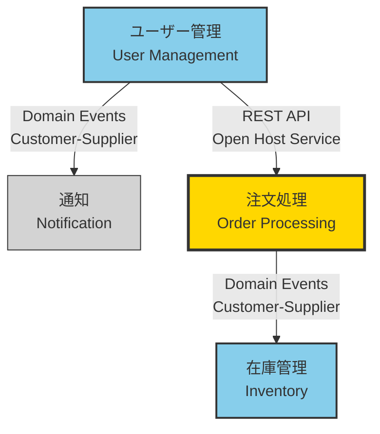
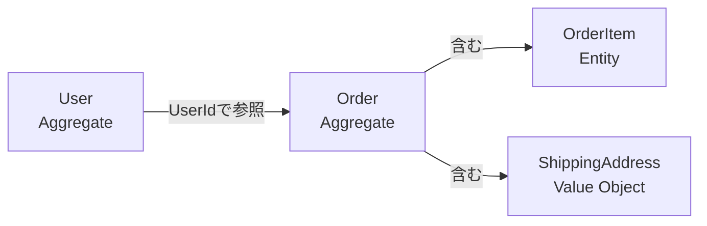
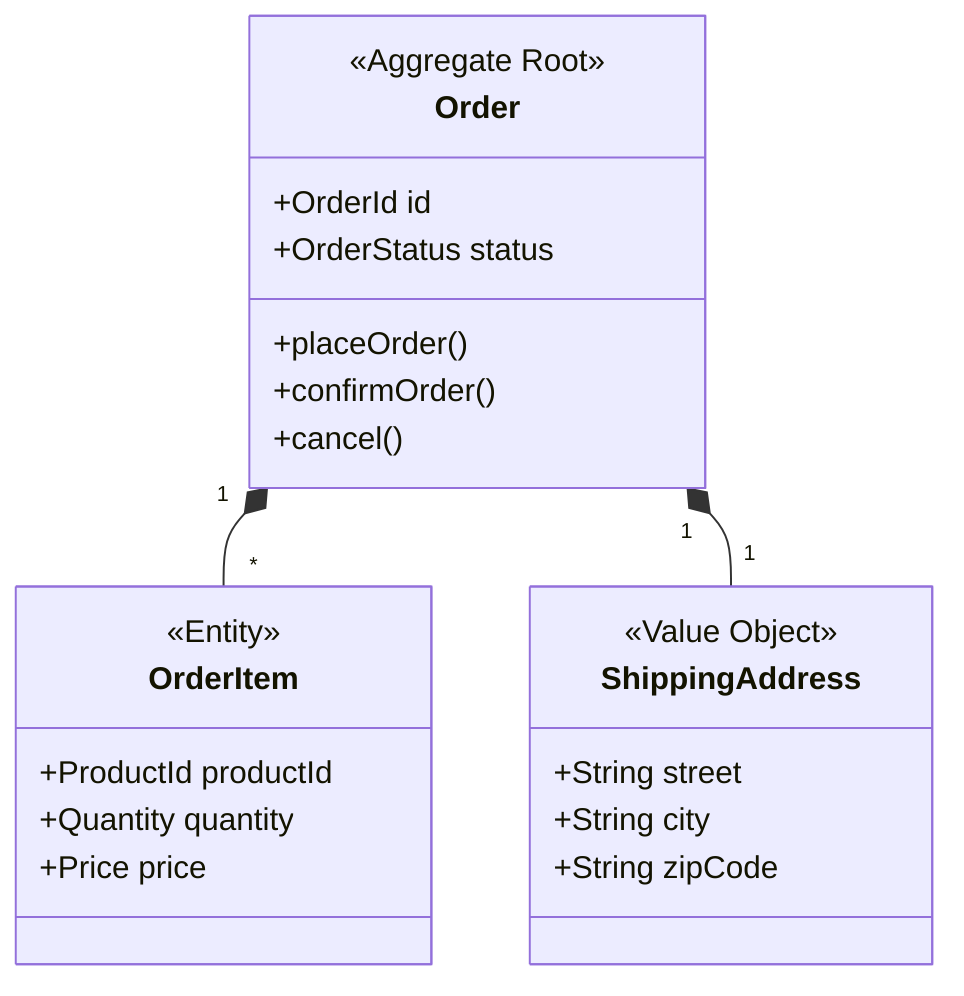
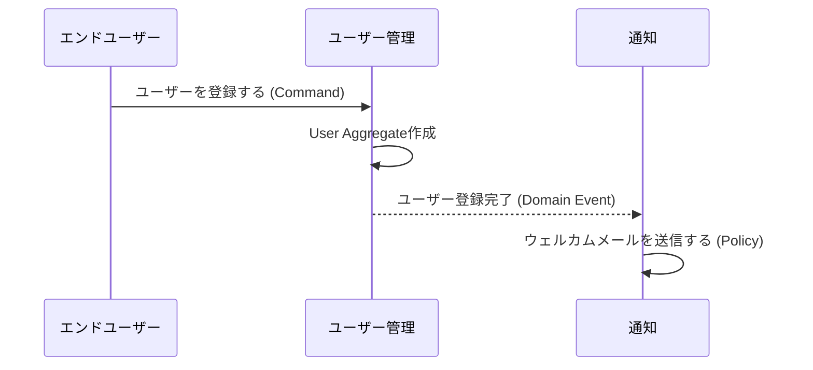

# /a-005-CreateDomainDiagram

## 目的

- ドメインモデルドキュメント（`01-domain-model.md`）を基に、視覚的なダイアグラムを作成する。
- Context Map（Bounded Context間の関係図）をMermaid形式で図示する。
- 各Bounded Context内のAggregate構造や関係性を図示する（オプション）。
- ドメインモデルの全体像を一目で理解できる視覚資料を提供する。

## 前提

- `docs/project/03-domain/01-domain-model.md` が作成されていること（先に `/a-004-DefineDomainModel` を実行）。
- ドメインモデルドキュメントに以下の情報が含まれていること：
  - Bounded Contextの一覧と戦略的分類（Core/Supporting/Generic）
  - Context間の関係性（上流/下流、関係パターン、通信方法）
  - 各ContextのAggregates（オプション：詳細図を作成する場合）

## 手順

### 1. ドメインモデルドキュメントの確認

- `@docs/project/03-domain/01-domain-model.md` を読み込む。

- ドキュメントが存在しない、または不完全な場合：
  - 「ドメインモデルが見つかりません。先に `/a-004-DefineDomainModel` を実行してください。」と通知し、ワークフローを中断。

### 2. Context Mapの情報収集

- ドメインモデルドキュメントから以下の情報を抽出：
  - **Bounded Contextのリスト**
  - **各Contextの戦略的分類**（Core / Supporting / Generic）
  - **Context間の関係性**（上流/下流、関係パターン、通信方法）

- ユーザーに確認：
  - 「以下のBounded Contextが見つかりました：」
  - Context一覧を表示
  - 「これらの関係性を図示します。追加や修正はありますか？」

### 3. Context Map 図の作成

#### 3.1. 基本構造の作成

- Mermaid graph TD（上から下）または LR（左から右）形式で図を作成：
  ```mermaid
  graph TD
      ContextA[Context名A] -->|関係パターン<br/>通信方法| ContextB[Context名B]
  ```

#### 3.2. 戦略的分類の視覚化

- スタイル定義で色分け：
  - **Core Domain**: 金色（`fill:#FFD700`）
  - **Supporting Domain**: 水色（`fill:#87CEEB`）
  - **Generic Domain**: グレー（`fill:#D3D3D3`）

#### 3.3. 関係性の表現

- エッジラベルに以下を含める：
  - 関係パターン（Customer-Supplier, Open Host Service など）
  - 通信方法（REST API, Domain Events, GraphQL など）
  - やり取りされるデータ（簡潔に）

例：


### 4. Aggregate構造図の作成（オプション）

- ユーザーに確認：「各Bounded Context内のAggregate構造も図示しますか？」

- 「はい」の場合、各Contextについて以下を実行：

#### 4.1. Aggregate関係図

- 各Bounded Context内のAggregatesの関係を図示：
  - Aggregate間の参照関係
  - ID参照（結合度が低い）
  - オブジェクト参照（結合度が高い）

例：


#### 4.2. Aggregate内部構造図

- 特に重要なAggregateについて、内部構造を図示：
  - ルートエンティティ
  - 含まれるエンティティ
  - 値オブジェクト

例：


### 5. イベントフロー図の作成（オプション）

- ユーザーに確認：「主要なビジネスフローをイベント図で表現しますか？」

- 「はい」の場合、時系列でCommand → Event → Policyの流れを図示：

例：


### 6. ドキュメントへの図の追加

- 作成した図を `01-domain-model.md` の適切な箇所に追加：
  - **Context Map図** → "Context Map（コンテキスト間の関係図）" セクション
  - **Aggregate構造図** → 各Bounded Contextのセクション内（オプション）
  - **イベントフロー図** → 新しいセクション "主要なイベントフロー" を作成（オプション）

- 既存のMermaid図がある場合は、ユーザーに確認：
  - 「既に図が存在します。上書きしますか？それとも新しいセクションに追加しますか？」

### 7. レビューと確認

- 作成した図をユーザーに提示：
  - 「図はドメインモデルを正確に表現していますか？」
  - 「見やすさや配置に問題はありませんか？」
  - 「追加すべき情報や削除すべき情報はありますか？」

- Mermaid図の調整：
  - レイアウトの変更（TD ↔ LR）
  - ノードの配置調整
  - ラベルの簡潔化

### 8. 完成とコミット準備

- 図が `docs/project/03-domain/01-domain-model.md` に追加されたことを確認。

- 作成した図の統計を表示：
  - Context Map図：作成済み
  - Aggregate構造図：X個作成
  - イベントフロー図：X個作成

- Git コミット準備完了を通知

## 完了条件

- `docs/project/03-domain/01-domain-model.md` にContext Map図が追加されている：
  - すべてのBounded Contextが含まれている
  - Context間の関係性が矢印とラベルで表現されている
  - 戦略的分類が色分けで視覚化されている

- Aggregate構造図（オプション）が追加されている場合：
  - 主要なAggregateの構造が図示されている
  - Aggregate間の参照関係が明確

- イベントフロー図（オプション）が追加されている場合：
  - 主要なビジネスフローが時系列で表現されている
  - Command、Event、Policyの流れが明確

- すべての図がMermaid形式で記述され、レンダリング可能である

- ユーザーが図の内容を確認し、承認している

## エスカレーション

- ドメインモデルドキュメントが不完全で図を作成できない場合：
  - 「ドメインモデルが不完全です。先に `/a-004-DefineDomainModel` を実行して、Bounded Contextと関係性を定義してください。」

- Mermaid図が複雑すぎて読みにくい場合：
  - 「図が複雑すぎます。以下の対策を検討してください：」
    - Contextを複数の図に分割
    - 主要な関係性のみを図示（詳細は表形式で補足）
    - レイアウトを変更（TD → LR、またはその逆）

- Context間の関係が循環している場合：
  - 「循環依存が検出されました。アーキテクチャの見直しが必要です。」
  - 循環を視覚的に強調し、ユーザーに警告

- Aggregate構造が複雑すぎる場合：
  - 「このAggregateは複雑すぎます。分割を検討してください。」
  - 最も重要なAggregateのみ図示し、残りはテキストで記述することを提案
