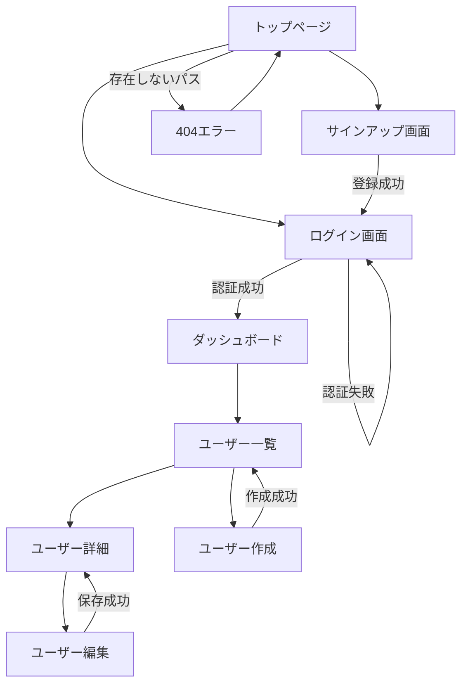

# /a-009-DefineScreenDesign

## 目的

- ユーザーストーリーとシナリオを基に、必要な画面を網羅的に抽出する。
- 各画面の役割、アクセス権限、考慮すべき状態（Empty State含む）を明確化する。
- 画面遷移フローをMermaid図で可視化し、ユーザーの導線を明確にする。
- レスポンシブデザインポリシー（ブレークポイント、デバイス対応方針）を定義する。
- 技術スタックと整合したデザイン方針を策定する。

## 前提

- `docs/project/01-requirements/05-user-stories.md` が作成されていること
- `docs/project/02-behavior/01-scenarios.md` が作成されていること（推奨）
- `docs/project/03-domain/01-domain-model.md` が作成されていること（推奨）
- `docs/project/04-design/01-tech-stack.md` が作成されていること（推奨）
- `.windsurf/templates/project/04-design/03-screen-design.md` テンプレートが最新状態であること

## 手順

### 1. ドキュメントと前提条件の確認

- 要件・設計ドキュメントを読み込む：
  - `@docs/project/01-requirements/05-user-stories.md`
  - `@docs/project/02-behavior/01-scenarios.md`（存在する場合）
  - `@docs/project/03-domain/01-domain-model.md`（存在する場合）
  - `@docs/project/04-design/01-tech-stack.md`（存在する場合）

- ドキュメントが不足している場合：
  - 「最低限、ユーザーストーリーが必要です。不足しているドキュメントがあります：[リスト]」
  - 利用可能なドキュメントの範囲で画面設計を行うことをユーザーに確認

### 2. 画面の抽出と分類

#### 2.1. シナリオとユーザーストーリーからの画面抽出

- ユーザーストーリーとシナリオを分析し、必要な画面を抽出：
  - Scenarioの Given ステップ：ユーザーがどの画面にいるか
  - Scenario の When ステップ：どの画面で操作を行うか
  - Scenario の Then ステップ：どの画面に遷移するか

- 抽出した画面を一覧化：
  - 「シナリオとユーザーストーリーから、以下の画面が見つかりました：」
  - 画面一覧を表示

#### 2.2. 標準的な画面の追加

抽出した画面に加えて、以下の標準的な画面を追加提案：

**認証関連**（該当する場合）:
- ログイン画面
- サインアップ画面
- パスワードリセット画面
- メール認証画面

**エラー画面**:
- 404 Not Found（ページが見つからない）
- 500 Server Error（サーバーエラー）
- 403 Forbidden（権限エラー）

**設定画面**（該当する場合）:
- アカウント設定
- プロフィール編集
- 通知設定

**管理画面**（該当する場合）:
- 管理ダッシュボード
- ユーザー管理
- システム設定

- ユーザーに確認：「上記の標準画面も追加しますか？」

#### 2.3. 画面のカテゴリ分類

画面を以下のカテゴリに分類：

- **認証関連**：ログイン、サインアップ、パスワードリセット
- **メイン機能**：ダッシュボード、一覧、詳細、作成、編集
- **設定関連**：アカウント設定、システム設定
- **エラー画面**：404、500、403
- **管理画面**：管理者専用機能（該当する場合）

### 3. 各画面の詳細定義（インタビュー）

各画面について、以下を**1つずつ順番に**ヒアリングする。

#### 3.1. 画面の基本情報

**質問1: 画面ID**
- 自動採番（SCR-001, SCR-002...）
- カテゴリごとに番号を割り振る（認証: SCR-001〜、メイン: SCR-010〜）

**質問2: 画面名**
- 「この画面の正式名称は何ですか？」
- 例：「ユーザー一覧」「ダッシュボード」「ログイン画面」

**質問3: 役割・目的**
- 「この画面の役割を1-2文で説明してください。」
- 「ユーザーはこの画面で何を達成しますか？」

**質問4: URL/パス**（Webアプリケーションの場合）
- 「この画面のURLパスは何ですか？」
- 例：`/login`、`/dashboard`、`/users`、`/users/:id`

**質問5: アクセス権限**
- 「誰がこの画面にアクセスできますか？」
  - 選択肢：
    - 全ユーザー（未認証含む）
    - 未認証ユーザーのみ（ログインページなど）
    - 認証済みユーザー
    - 特定ロール（管理者、オーナーなど）
    - 本人のみ（プロフィール編集など）

#### 3.2. 画面の状態とEmpty State（重要！）

**Empty State（空状態）の考慮は非常に重要**です。開発時に忘れられがちで、UXに大きな影響を与えます。

**質問6: 画面の主要な状態**
- 「この画面がとりうる主要な状態は何ですか？」

以下の状態パターンを確認：

**1. 初回訪問（First Use）**
- 「初めて訪問したとき、まだデータが作成されていない状態はありますか？」
- ある場合：「どのようなメッセージやCTA（Call To Action）を表示しますか？」
  - 例：「最初のプロジェクトを作成」ボタン、「まだアイテムがありません」メッセージ

**2. 通常状態（Normal）**
- 「データが存在する通常の状態では、何が表示されますか？」
  - リスト、カード、テーブル、グラフなど

**3. 検索・フィルタ結果なし（No Results）**（検索機能がある場合）
- 「検索やフィルタの結果、一致するデータがない場合はありますか？」
- ある場合：「どのようなメッセージやCTAを表示しますか？」
  - 例：「検索条件をクリア」リンク、「一致する結果がありません」

**4. エラー状態（Error）**
- 「データ読み込み失敗やネットワークエラーの場合、どのように表示しますか？」
  - 例：「再試行」ボタン、エラーメッセージ

**5. ローディング状態（Loading）**
- 「データ取得中の状態をどのように表示しますか？」
  - 選択肢：
    - スケルトンスクリーン（推奨）
    - スピナー
    - プログレスバー
    - 何も表示しない（非推奨）

**6. その他の状態**
- 「その他、特殊な状態はありますか？」
  - 例：下書き状態、公開済み状態、アーカイブ状態

#### 3.3. 画面のレイアウト・コンポーネント構成（簡潔に）

**質問7: 主要なUIコンポーネント**
- 「この画面の主要なUIコンポーネントは何ですか？」
  - ヘッダー、ナビゲーション、サイドバー
  - フォーム、テーブル、カード一覧
  - ボタン、モーダル、ドロワー

**注意**: 詳細な実装仕様（ボタンの色、フォントサイズなど）はここでは不要。コードやStorybook、Figmaに委ねる。

#### 3.4. 次の画面へ

- すべての画面について手順3.1〜3.3を繰り返す。

### 4. 画面遷移図の作成

#### 4.1. 主要な遷移フローの特定

- 「主要なユーザーフローを特定します。」

**認証フロー**（該当する場合）:
- 未認証 → ログイン → ダッシュボード
- 未認証 → サインアップ → メール認証 → ログイン
- ログイン → パスワードリセット

**メイン機能フロー**:
- ダッシュボード → 一覧 → 詳細
- ダッシュボード → 作成フォーム → 一覧
- 詳細 → 編集フォーム → 詳細

**設定フロー**:
- ダッシュボード → アカウント設定 → 保存 → ダッシュボード

**エラーフロー**:
- 任意の画面 → 404エラー → トップページ
- 任意の画面 → 403エラー → ログイン

#### 4.2. Mermaid図の作成

主要な遷移フローをMermaid flowchart で図示：

**ベストプラクティス**:
- 複雑な場合は、複数の図に分割（認証フロー図、メイン機能フロー図、管理フロー図）
- 遷移条件をラベルで明記（`|認証成功|`、`|エラー時|`）
- グループ化（`subgraph`）で視覚的に整理

#### 4.3. 遷移図のレビュー

- ユーザーに提示：「この遷移図は正しいですか？不足している遷移や誤った遷移はありますか？」
- デッドエンド（戻れない画面）がないか確認

### 5. レスポンシブデザインポリシーの定義

#### 5.1. 技術スタックの確認

- 技術スタックドキュメントを参照し、フロントエンド技術を確認：
  - CSSフレームワーク（Tailwind CSS、Bootstrap、Materializeなど）
  - UIライブラリ（MUI、Ant Design、Chakra UIなど）

- CSSフレームワークがある場合、そのデフォルトブレークポイントを推奨

#### 5.2. ブレークポイントの定義

**質問1: ブレークポイント戦略**
- 「ブレークポイントはどのように定義しますか？」

**推奨案を提示**:

| ブレークポイント | 画面幅 | 対象デバイス |
|-----------------|--------|-------------|
| **xs** (Extra Small) | `< 640px` | スマートフォン（縦） |
| **sm** (Small) | `≥ 640px` | スマートフォン（横）、小型タブレット |
| **md** (Medium) | `≥ 768px` | タブレット（縦） |
| **lg** (Large) | `≥ 1024px` | タブレット（横）、小型ノートPC |
| **xl** (Extra Large) | `≥ 1280px` | デスクトップ、ノートPC |
| **2xl** (2X Large) | `≥ 1536px` | 大型デスクトップ、4Kモニター |

- Tailwind CSSの場合：デフォルトブレークポイントをそのまま採用推奨
- カスタムブレークポイントの場合：ターゲットデバイスに応じて調整

**質問2: モバイルファースト vs デスクトップファースト**
- 「デザイン戦略は？」
  - **モバイルファースト**（推奨）：最小画面から設計し、徐々に大画面に対応
  - **デスクトップファースト**：デスクトップから設計し、徐々に小画面に対応

#### 5.3. デバイス対応方針

**質問3: 対応優先度**
- 「各デバイスの対応優先度を教えてください。」

| デバイスカテゴリ | 対応優先度 | 画面幅範囲 |
|----------------|-----------|-----------|
| **スマートフォン** | 必須 / 推奨 / 検討中 / 対応外 | 320px - 640px |
| **タブレット** | 必須 / 推奨 / 検討中 / 対応外 | 640px - 1024px |
| **ノートPC / デスクトップ** | 必須 / 推奨 / 検討中 / 対応外 | 1024px - 1920px |
| **大型モニター (4K)** | 必須 / 推奨 / 検討中 / 対応外 | 1920px 以上 |

- 追加質問：「ターゲットユーザーの主要なデバイスは何ですか？」

#### 5.4. レイアウトパターン

**質問4: ナビゲーションパターン**
- 「デバイスごとのナビゲーション表示方法は？」

| デバイス | パターン |
|---------|---------|
| **モバイル** | ハンバーガーメニュー / ボトムナビゲーション / タブバー |
| **タブレット** | サイドドロワー / タブバー |
| **デスクトップ** | 固定サイドバー / トップナビゲーション |

**質問5: コンテンツレイアウト**
- 「主要な画面要素（カード一覧、フォームなど）のレイアウトは？」

| 画面要素 | モバイル | タブレット | デスクトップ |
|---------|---------|-----------|-------------|
| **カラム数** | 1カラム | 2カラム | 3-4カラム |
| **サイドバー** | 非表示（ドロワー） | 折りたたみ可能 | 常時表示 |
| **カード一覧** | 縦積み | 2列グリッド | 3-4列グリッド |
| **テーブル** | 横スクロール / カード形式 | 横スクロール | フル表示 |

#### 5.5. 画像・メディア対応

**質問6: 画像最適化方針**
- 「画像やメディアの最適化方針は？」

| 項目 | 方針 |
|------|------|
| **レスポンシブ画像** | `srcset`と`sizes`を使用 / Next.js Imageなど |
| **画像フォーマット** | WebP/AVIF優先、JPEG/PNGフォールバック |
| **遅延ローディング** | ファーストビュー外は `loading="lazy"` |
| **アスペクト比** | `aspect-ratio` CSSで事前確保 |

#### 5.6. タッチインタラクション

**質問7: タッチ対応**
- 「タッチデバイスでの操作性を考慮しますか？」

| 項目 | ガイドライン |
|------|------------|
| **タップターゲットサイズ** | 最小 44x44px（推奨 48x48px） |
| **要素間の余白** | 最小 8px |
| **ホバー効果** | タッチデバイスでは `:active` を使用 |
| **スワイプジェスチャー** | カルーセル、ドロワー開閉で活用 |

#### 5.7. パフォーマンス目標

**質問8: パフォーマンス目標**
- 「Core Web Vitals の目標値を設定しますか？」

| 項目 | 目標値 |
|------|-------|
| **LCP (Largest Contentful Paint)** | < 2.5秒 |
| **FID (First Input Delay)** | < 100ms |
| **CLS (Cumulative Layout Shift)** | < 0.1 |
| **バンドルサイズ** | 初回 < 200KB (gzip圧縮後) |

### 6. デザイン参考資料（オプション）

**質問9: デザインモックやスタイルガイド**
- 「Figmaやその他のデザインツールでモックを作成していますか？」
- ある場合：URLやリンクを記録

| リソース | URL |
|---------|-----|
| **Figmaデザイン** | [URL] |
| **Storybook** | [URL] |
| **デザインシステム** | [URL] |

### 7. ドキュメント作成

- 収集した情報を基に、`docs/project/04-design/03-screen-design.md` を作成

- テンプレートに従い、以下を記載：
  - **画面一覧**（カテゴリごとにテーブル形式）
    - 画面ID、画面名、役割・目的、アクセス権限、考慮すべき状態・Empty State
  - **画面遷移図**（Mermaid flowchart）
  - **画面カテゴリ・役割**（各カテゴリの説明）
  - **レスポンシブデザインポリシー**
    - ブレークポイント定義
    - デバイス対応方針
    - レイアウトパターン
    - 画像・メディア対応
    - タッチインタラクション
    - パフォーマンス考慮事項
  - **デザイン参考資料**（オプション）
  - **メモ**（補足情報）

- **HTMLコメントは削除せず残す**

### 8. レビューと確認

- 作成したドキュメントをユーザーに提示：
  - 「画面設計ドキュメントが完成しました。内容を確認してください。」
  - 「すべての画面が網羅されていますか？」
  - 「Empty State（データがない状態）が考慮されていますか？」
  - 「画面遷移フローに漏れはありませんか？」

- 統計情報を表示：
  - 画面総数
  - カテゴリ別の内訳（認証: X画面、メイン機能: X画面、設定: X画面、エラー: X画面）
  - Empty State考慮済み画面数

### 9. 完成とコミット準備

- `docs/project/04-design/03-screen-design.md` が保存されたことを確認

- 次のステップを提案：
  - 「画面設計が完了しました。次はデータモデルを定義しますか？（`/a-010-DefineDataModel`）」

## 完了条件

- `docs/project/04-design/03-screen-design.md` が作成されている
- 以下のセクションがすべて記載されている：
  - 画面一覧（カテゴリ別テーブル）
  - 画面遷移図（Mermaid flowchart）
  - レスポンシブデザインポリシー（ブレークポイント、デバイス対応方針、レイアウトパターン）
- 各画面について以下が定義されている：
  - 画面ID（一意）
  - 画面名
  - 役割・目的（1-2文）
  - アクセス権限
  - 考慮すべき状態・Empty State（特にEmpty Stateは必須）
- 画面遷移図がMermaid形式で記述され、レンダリング可能である
- 主要な遷移フローが図示されている
- デッドエンド（戻れない画面）がない
- レスポンシブデザインポリシーが技術スタックと整合している
- ブレークポイントが明確に定義されている
- ユーザーが内容を確認し、承認している

## エスカレーション

- シナリオやユーザーストーリーが不足していて画面を抽出できない場合：
  - 「シナリオが不足しているため、画面を網羅的に抽出できません。先に `/a-003-CreateScenarios` を実行してシナリオを充実させてください。」

- Empty State（空状態）が考慮されていない画面がある場合：
  - 「[画面名]のEmpty State（データがない状態）が定義されていません。Empty Stateは重要なUX要素です。以下の状態を検討してください：」
  - 初回訪問、検索結果なし、エラー状態などを提案

- 画面遷移にデッドエンドがある場合：
  - 「[画面名]から戻る導線がありません。ユーザーがこの画面で迷子にならないよう、戻るボタンやナビゲーションを追加してください。」

- 画面数が非常に多い（50画面以上）場合：
  - 「画面数が多すぎます（X画面）。まずはMVP（最小限の機能）に必要な画面に絞り、段階的に追加することを推奨します。」

- レスポンシブ対応が技術スタックと不整合な場合：
  - 「技術スタック（[技術名]）のデフォルトブレークポイントと異なる値を選択しています。カスタマイズする理由を明確にしてください。」

- モバイル対応が不十分な場合：
  - 「スマートフォンでの対応が不十分です。ターゲットユーザーの多くがモバイルからアクセスする場合、モバイルファーストでデザインすることを強く推奨します。」

- 画面遷移が複雑すぎる場合：
  - 「画面遷移が複雑すぎて、ユーザーが迷う可能性があります。以下の簡素化を検討してください：」
    - 画面の統合（似た役割の画面を1つにまとめる）
    - パンくずリストの追加
    - 明確なナビゲーション構造

- アクセス権限が曖昧な場合：
  - 「アクセス権限が曖昧です。各画面について、誰がアクセスできるかを明確にしてください。セキュリティリスクにつながります。」
