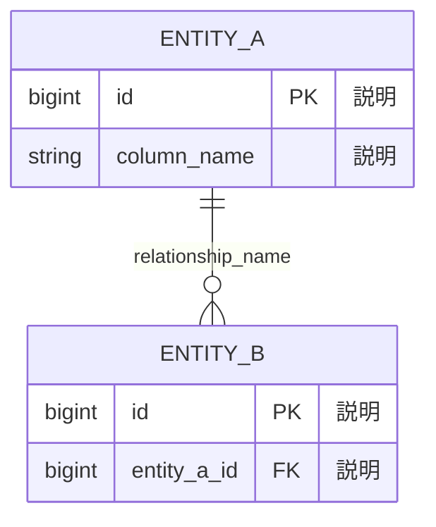

# /a-010-DefineDataModel

## 目的

- ドメインモデル（Aggregates）と画面設計を基に、データベース構造を定義する。
- エンティティ（テーブル）、属性（カラム）、リレーションシップを明確化する。
- データ型、制約（NOT NULL、UNIQUE、CHECK）、インデックス戦略を決定する。
- Mermaid ERD（Entity Relationship Diagram）で視覚化し、開発者間の認識を統一する。
- 正規化・非正規化の判断根拠を記録し、将来のスキーマ変更の指針とする。

## 前提

- `docs/project/03-domain/01-domain-model.md` が作成されていること（推奨）
- `docs/project/04-design/01-tech-stack.md` が作成されていること（データベース選定済み）
- `docs/project/04-design/03-screen-design.md` が作成されていること（推奨）
- `.windsurf/templates/project/04-design/04-data-model.md` テンプレートが最新状態であること

## 手順

### 1. ドキュメントと前提条件の確認

- 関連ドキュメントを読み込む：
  - `@docs/project/03-domain/01-domain-model.md`（Aggregates、ドメインエンティティ）
  - `@docs/project/04-design/01-tech-stack.md`（データベース選定、ORM選定）
  - `@docs/project/04-design/03-screen-design.md`（画面で必要なデータ項目）

- ドキュメントが不足している場合：
  - 「ドメインモデルまたは技術スタックが定義されていません。最低限、データベース選定（RDBMS or NoSQL）が必要です。」
  - 利用可能なドキュメントの範囲でデータモデルを作成することをユーザーに確認

### 2. データベース技術の確認

#### 2.1. 選定されたデータベースの確認

- 技術スタックドキュメントからデータベース技術を確認：
  - RDBMS（PostgreSQL、MySQL、SQLiteなど）
  - NoSQL（MongoDB、DynamoDBなど）
  - ハイブリッド（RDBMSメイン + NoSQL補助）

#### 2.2. データモデリング戦略の決定

**RDBMS の場合**:
- リレーショナルモデル（正規化）
- エンティティ、属性、リレーションシップを定義
- ERD（Entity Relationship Diagram）を作成

**NoSQL（ドキュメント型）の場合**:
- コレクション、ドキュメント構造を定義
- 埋め込み vs 参照の判断
- データの重複を許容する場合がある

**ハイブリッドの場合**:
- RDBMSの部分とNoSQLの部分を明確に分離
- このワークフローではRDBMS部分を優先的に定義

**このワークフローの対象**:
- 主にRDBMSを対象とする
- NoSQLの場合は、スキーマ設計として読み替える

### 3. エンティティの抽出

#### 3.1. ドメインモデルからのエンティティ抽出

- ドメインモデルの **Aggregates** を確認：
  - 各Aggregateは通常1つ以上のエンティティ（テーブル）に対応
  - Aggregate Root は必ずエンティティになる
  - Aggregate内のエンティティも個別のテーブルになることがある

- 「ドメインモデルから以下のAggregatesが見つかりました：」
  - Aggregate一覧を表示
  - 各Aggregateをエンティティとして抽出

#### 3.2. 画面設計からの追加エンティティ抽出

- 画面設計で言及されているデータ項目を確認：
  - 画面一覧、フォーム入力項目、テーブル表示項目
  - ドメインモデルに含まれていないエンティティがある場合は追加

- 例：
  - 通知（Notification）
  - セッション（Session）
  - 監査ログ（AuditLog）
  - 添付ファイル（Attachment）

#### 3.3. エンティティの分類

抽出したエンティティを以下のカテゴリに分類：

- **コアエンティティ**: ビジネスの中心（User, Order, Product）
- **参照エンティティ**: マスタデータ（Category, Status, Country）
- **関連エンティティ**: 多対多の中間テーブル（UserRole, OrderItem）
- **履歴エンティティ**: 監査ログ、変更履歴（AuditLog, OrderHistory）

- ユーザーに提示：「以下のエンティティを定義します：」
  - エンティティ一覧を表示
  - 「不足しているエンティティや削除すべきエンティティはありますか？」

### 4. 各エンティティの詳細定義（インタビュー）

各エンティティについて、以下を**1つずつ順番に**ヒアリングする。

#### 4.1. エンティティの基本情報

**質問1: テーブル名（物理名）**
- 「このエンティティのテーブル名は何にしますか？」
  - 推奨：複数形、スネークケース（例：`users`, `order_items`）
  - ORMの規約に従う（例：Rails は複数形、Django は単数形も許容）

**質問2: エンティティの説明**
- 「このエンティティが表現するビジネス概念を説明してください。」
- 「このエンティティの責務と役割は何ですか？」

**質問3: ドメインモデルとの対応**
- 「このエンティティはドメインモデルのどのAggregateに対応しますか？」
- Aggregateとの対応を記録

#### 4.2. 主キーの定義

**質問4: 主キーのデータ型**
- 「主キー（`id`）のデータ型は何にしますか？」
  - 選択肢：
    - **bigint (BIGINT)**: 自動増分ID（推奨、最大922京）
    - **uuid (UUID)**: グローバル一意識別子（分散システム向き）
    - **string (VARCHAR)**: カスタムID（例：`USR-001`）
    - **composite key**: 複合主キー（複数カラムの組み合わせ）

- UUIDの場合：「バージョンは？」
  - UUID v4（ランダム）が一般的
  - UUID v7（タイムスタンプベース）も選択肢

#### 4.3. 属性（カラム）の定義

**質問5: 主要な属性**
- 「このエンティティの主要な属性（カラム）をリストアップしてください。」
- ドメインモデルのAggregate内のプロパティを参考にする

各属性について、以下をヒアリング：

**属性名**:
- 「カラム名は何にしますか？」
- 推奨：スネークケース（例：`user_name`, `created_at`）

**データ型**:
- 「この属性のデータ型は何ですか？」

データベースごとの主要なデータ型：

| カテゴリ | PostgreSQL | MySQL | 用途 |
|---------|-----------|-------|------|
| **整数** | `INTEGER`, `BIGINT` | `INT`, `BIGINT` | ID、数量、カウント |
| **小数** | `DECIMAL(p,s)`, `NUMERIC` | `DECIMAL(p,s)` | 金額、正確な小数 |
| **浮動小数点** | `REAL`, `DOUBLE PRECISION` | `FLOAT`, `DOUBLE` | 近似値（科学計算） |
| **文字列** | `VARCHAR(n)`, `TEXT` | `VARCHAR(n)`, `TEXT` | 名前、説明、長文 |
| **真偽値** | `BOOLEAN` | `TINYINT(1)`, `BOOLEAN` | フラグ |
| **日時** | `TIMESTAMP`, `DATE`, `TIME` | `DATETIME`, `DATE`, `TIME` | 作成日時、更新日時 |
| **JSON** | `JSON`, `JSONB` | `JSON` | 柔軟なスキーマ |
| **列挙型** | `ENUM` (CREATE TYPE) | `ENUM` | ステータス、カテゴリ |
| **バイナリ** | `BYTEA` | `BLOB` | ファイル、画像 |
| **UUID** | `UUID` | `CHAR(36)` | グローバル一意ID |

**制約**:
- 「この属性に制約はありますか？」
  - **NOT NULL**: 必須項目
  - **UNIQUE**: 一意制約（重複不可）
  - **CHECK**: 値の範囲や条件（例：`price >= 0`）
  - **DEFAULT**: デフォルト値（例：`status DEFAULT 'pending'`）

**説明**:
- 「この属性の説明やコメントを記載してください。」

#### 4.4. タイムスタンプ（監査カラム）

**質問6: タイムスタンプカラム**
- 「作成日時（`created_at`）と更新日時（`updated_at`）を追加しますか？」
  - 推奨：ほとんどのエンティティに追加
  - データ型：`TIMESTAMP` または `DATETIME`
  - 制約：`NOT NULL`, `DEFAULT CURRENT_TIMESTAMP`

**質問7: 論理削除（ソフトデリート）**
- 「このエンティティは論理削除にしますか？物理削除にしますか？」
  - **論理削除**: `deleted_at TIMESTAMP NULL`（削除フラグ代わり）
  - **物理削除**: DELETE文で完全に削除

- 論理削除の利点：
  - データ復元が可能
  - 監査・履歴の保持
  - 外部キー制約との整合性

- 物理削除の利点：
  - ストレージ効率が良い
  - クエリがシンプル

#### 4.5. 列挙型（ENUM）やステータス

**質問8: 列挙型カラム**
- 「ステータスやカテゴリなど、固定値の選択肢がある属性はありますか？」

列挙型の実装方法：

**A. ENUM型を使用**（PostgreSQL、MySQL）:
- データ型：`ENUM('pending', 'confirmed', 'shipped')`
- 利点：型安全性、ストレージ効率
- 欠点：値の追加がALTER TABLE必要

**B. VARCHAR + CHECK制約**:
- データ型：`VARCHAR(20) CHECK (status IN ('pending', 'confirmed', 'shipped'))`
- 利点：柔軟性が高い
- 欠点：ストレージ効率やや低い

**C. 参照テーブル**（正規化）:
- 別テーブル（`statuses`）を作成し、外部キーで参照
- 利点：値の追加が容易、国際化対応
- 欠点：JOIN が増える

- 「どの実装方法を採用しますか？」

#### 4.6. 次のエンティティへ

- すべてのエンティティについて手順4.1〜4.5を繰り返す。

### 5. リレーションシップの定義

#### 5.1. リレーションシップの抽出

- ドメインモデルのAggregates間の関係を確認：
  - 各Aggregateは他のAggregateをIDで参照
  - この参照関係が外部キーになる

- 「エンティティ間の関係を定義します。」

#### 5.2. 各リレーションシップの詳細定義

各リレーションシップについて、以下をヒアリング：

**質問1: 関係性の多重度**
- 「[エンティティA] と [エンティティB] の関係性は何ですか？」
  - **1:1（一対一）**: 1つのAが1つのBに対応（例：User ↔ Profile）
  - **1:N（一対多）**: 1つのAが複数のBに対応（例：User → Orders）
  - **N:M（多対多）**: 複数のAが複数のBに対応（例：User ↔ Roles）

**質問2: 外部キー**
- 「外部キーとして使用するカラム名は何ですか？」
- 推奨命名規則：`{参照先テーブル名}_id`（例：`user_id`, `product_id`）

**質問3: 外部キー制約**
- 「ON DELETE の動作はどうしますか？」
  - **CASCADE**: 親レコード削除時、子レコードも削除
  - **SET NULL**: 親レコード削除時、外部キーを NULL に設定
  - **RESTRICT**: 子レコードがある場合、親レコード削除を拒否（推奨：意図しない削除防止）

- 「ON UPDATE の動作はどうしますか？」
  - 通常は **CASCADE**（主キー更新は稀）

**質問4: NOT NULL制約**
- 「この外部キーは必須ですか？それともオプションですか？」
  - 必須：`NOT NULL`
  - オプション：`NULL` 許容

**多対多（N:M）の場合**:
- 中間テーブルを作成
- 中間テーブル名：`{エンティティA名}_{エンティティB名}`（例：`user_roles`）
- 中間テーブルの主キー：
  - 複合主キー（`(user_id, role_id)`）
  - または独立したID

#### 5.3. 循環参照のチェック

- 「リレーションシップに循環参照はありませんか？」
- 例：A → B → C → A
- 循環参照がある場合：
  - ビジネスロジック上必要か確認
  - 必要な場合は、ON DELETE RESTRICT で無限ループを防ぐ

### 6. 正規化・非正規化の判断

#### 6.1. 正規化の原則

**第1正規形（1NF）**:
- 各セルに単一の値（繰り返しグループを排除）
- 例：NG: `tags VARCHAR` に `"tag1,tag2,tag3"` 格納 → OK: `tags` テーブルに分離

**第2正規形（2NF）**:
- 部分関数従属性を排除
- 複合主キーの一部にのみ依存する属性を分離

**第3正規形（3NF）**:
- 推移的関数従属性を排除
- 非キー属性が他の非キー属性に依存する場合を分離

#### 6.2. 非正規化の検討

以下の場合、意図的に非正規化を検討：

**パフォーマンス最適化**:
- 「頻繁にJOINされるデータを非正規化しますか？」
- 例：`order_items` テーブルに `unit_price` を保持（`products.price` の変更の影響を避ける）

**集計値の事前計算**:
- 「集計値（合計、カウント）を保持しますか？」
- 例：`users.orders_count`（`COUNT(orders)` の事前計算）

**履歴データの保持**:
- 「過去のデータを変更不可能にしますか？」
- 例：注文時の商品価格、住所を注文テーブルに複製

- 非正規化する場合：
  - 理由を明記（パフォーマンス、データ整合性）
  - 同期メカニズムを検討（トリガー、アプリケーションロジック）

### 7. インデックス戦略

#### 7.1. インデックスが必要なカラム

以下のカラムにインデックスを推奨：

- **主キー（PK）**: 自動的にインデックス作成
- **外部キー（FK）**: 必須（JOIN のパフォーマンス向上）
- **UNIQUE制約**: 自動的にインデックス作成
- **検索条件に頻繁に使われるカラム**: `WHERE` 句で使用
- **ソート条件に使われるカラム**: `ORDER BY` 句で使用

**質問1: 追加インデックス**
- 「頻繁に検索されるカラムはありますか？」
- 例：`users.email`, `orders.status`, `products.category_id`

**質問2: 複合インデックス**
- 「複数のカラムを組み合わせて検索することはありますか？」
- 例：`(user_id, created_at)` の複合インデックス

#### 7.2. インデックスのトレードオフ

- インデックスの利点：
  - SELECT クエリの高速化
  - JOIN の高速化

- インデックスの欠点：
  - INSERT/UPDATE/DELETE の低速化
  - ストレージ使用量の増加

- 「インデックスは必要最小限にしますか？それとも積極的に追加しますか？」

### 8. ERD（Entity Relationship Diagram）の作成

#### 8.1. Mermaid ERD の生成

収集した情報を基に、Mermaid ERD を作成：

**基本構造**:

**リレーションシップ記法**:
- `||--||` : 1対1（必須-必須）
- `||--o|` : 1対0..1（必須-オプション）
- `||--o{` : 1対多（必須-0以上）
- `|o--o{` : 0..1対多
- `}o--o{` : 多対多

**データ型の記載**:
- `bigint`, `string`, `decimal`, `datetime`, `boolean`, `text`, `json`

**制約の記載**:
- `PK`: Primary Key
- `FK`: Foreign Key
- `UK`: Unique Key

#### 8.2. ERDの分割（オプション）

- エンティティ数が多い場合（10個以上）、複数のERDに分割：
  - **コアドメイン図**：主要なビジネスエンティティ
  - **認証・ユーザー管理図**
  - **支払い・決済図**
  - **ログ・監査図**

- ユーザーに確認：「ERDを複数の図に分割しますか？」

### 9. ドキュメント作成

- 収集した情報を基に、`docs/project/04-design/04-data-model.md` を作成

- テンプレートに従い、以下を記載：
  - **エンティティ一覧**（テーブル形式）
    - エンティティ名、説明、主要属性、備考（論理削除、制約など）
  - **リレーションシップ**（テーブル形式）
    - エンティティA/B、関係性（1:1, 1:N, N:M）、外部キー、制約（ON DELETE/UPDATE）、備考
  - **ERD（Entity Relationship Diagram）**（Mermaid形式）
  - **インデックス戦略**（オプション）
    - 各エンティティの推奨インデックス一覧
  - **正規化・非正規化の判断**（オプション）
    - 意図的な非正規化とその理由
  - **マイグレーション方針**（オプション）
    - スキーマバージョン管理の方針
  - **メモ**（補足情報）

- **HTMLコメントは削除せず残す**

### 10. レビューと確認

- 作成したドキュメントをユーザーに提示：
  - 「データモデルドキュメントが完成しました。内容を確認してください。」
  - 「すべてのエンティティとリレーションシップが正確に表現されていますか？」
  - 「正規化は適切ですか？パフォーマンス上の懸念はありませんか？」
  - 「外部キー制約（ON DELETE）は適切ですか？意図しないデータ削除のリスクはありませんか？」

- 統計情報を表示：
  - エンティティ総数
  - カテゴリ別の内訳（コア: X個、参照: X個、関連: X個、履歴: X個）
  - リレーションシップ総数
  - 1:1, 1:N, N:M の内訳

### 11. 完成とコミット準備

- `docs/project/04-design/04-data-model.md` が保存されたことを確認

- 次のステップを提案：
  - 「データモデルが完了しました。次はAPI仕様を定義しますか？（`/a-011-DefineAPISpec`）」
  - または：「マイグレーションファイルを作成しますか？」

## 完了条件

- `docs/project/04-design/04-data-model.md` が作成されている
- 以下のセクションがすべて記載されている：
  - エンティティ一覧（各エンティティの説明、主要属性、備考）
  - リレーションシップ（関係性、外部キー、制約）
  - ERD（Mermaid形式）
- 各エンティティについて以下が定義されている：
  - テーブル名（物理名）
  - 説明（ビジネス概念、責務）
  - 主キーのデータ型
  - 主要な属性（カラム名、データ型、制約、説明）
  - タイムスタンプカラム（created_at, updated_at）
  - 論理削除または物理削除の方針
- 各リレーションシップについて以下が定義されている：
  - 関係性の多重度（1:1, 1:N, N:M）
  - 外部キーのカラム名
  - ON DELETE/UPDATE の動作
  - NOT NULL制約の有無
- ERDがMermaid形式で記述され、レンダリング可能である
- すべてのエンティティとリレーションシップがERDに含まれている
- ドメインモデル（Aggregates）との対応が明確である
- ユーザーが内容を確認し、承認している

## エスカレーション

- ドメインモデルが不足していてエンティティを抽出できない場合：
  - 「ドメインモデルが不足しています。先に `/a-004-DefineDomainModel` を実行してAggregatesを定義してください。」
  - または：「利用可能な情報（画面設計、ユーザーストーリー）からエンティティを推測しますか？」

- データベース技術が選定されていない場合：
  - 「データベース技術が選定されていません。先に `/a-007-DefineTechStack` を実行してください。」

- リレーションシップに循環参照がある場合：
  - 「以下の循環参照が検出されました：[A → B → C → A]。ビジネスロジック上、本当に必要ですか？」
  - 必要な場合：「ON DELETE RESTRICT を設定し、アプリケーション側で削除順序を制御してください。」

- 外部キー制約が CASCADE だらけの場合：
  - 「ON DELETE CASCADE が多すぎます。意図しないデータの連鎖削除のリスクがあります。慎重に見直してください。」
  - RESTRICT を推奨

- 正規化が不十分な場合：
  - 「正規化が不十分です。以下の問題があります：[詳細]。意図的な非正規化でない場合は、正規化を検討してください。」

- 非正規化が過剰な場合：
  - 「非正規化が過剰です。データの不整合リスクが高まります。本当にパフォーマンス上必要ですか？」
  - 先にクエリ最適化やインデックス追加を検討

- エンティティ数が非常に多い（50個以上）場合：
  - 「エンティティ数が多すぎます（X個）。まずはMVPに必要なエンティティに絞り、段階的に追加することを推奨します。」

- インデックスが不足している場合：
  - 「外部キーにインデックスが設定されていません。JOINのパフォーマンスが低下します。以下のカラムにインデックスを追加してください：[リスト]」

- データ型の選択が不適切な場合：
  - 「金額に FLOAT/DOUBLE を使用しています。精度の問題があるため、DECIMAL を使用してください。」
  - 「大量のテキストを VARCHAR(255) に格納しています。TEXT 型を検討してください。」

- 論理削除と物理削除が混在している場合：
  - 「エンティティによって論理削除と物理削除が混在しています。一貫性を保つため、プロジェクト全体のポリシーを決定してください。」

- ドメインモデルとデータモデルの乖離が大きい場合：
  - 「ドメインモデルのAggregateとデータモデルのエンティティが大きく乖離しています。以下の不整合があります：[詳細]。どちらを修正しますか？」
