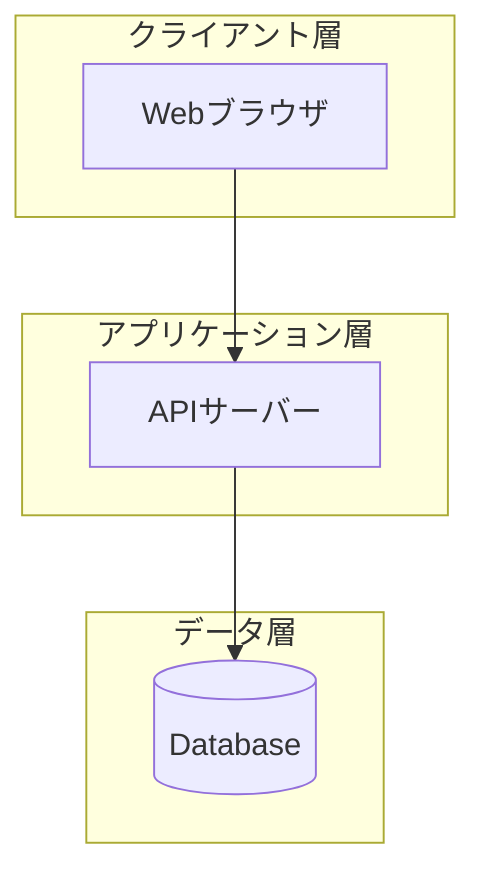
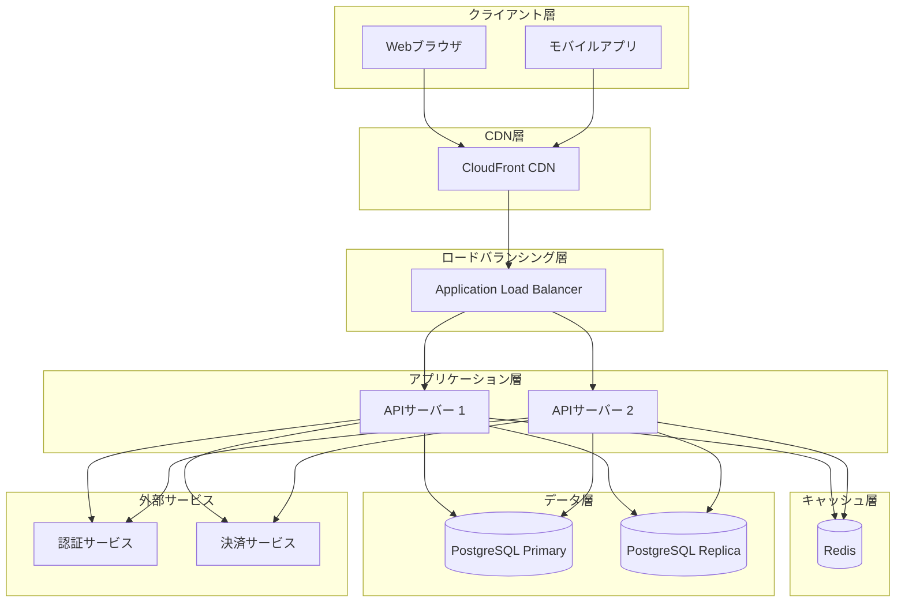
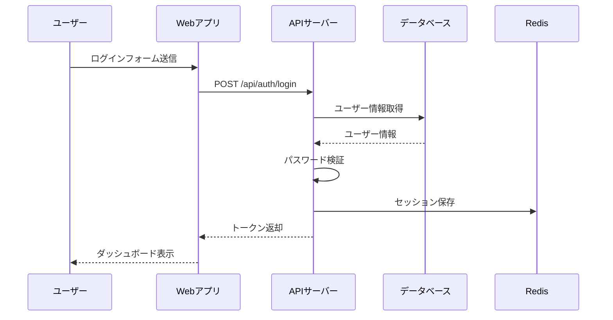

# /a-012-DefineArchitecture

## 目的

- これまでに定義された設計（技術スタック、リポジトリ構造、データモデル、API仕様）を統合する。
- システム全体の構造をMermaid図で視覚化する。
- 採用したアーキテクチャパターン（レイヤードアーキテクチャ、クリーンアーキテクチャなど）を明確化する。
- 重要なアーキテクチャ決定（ADR: Architecture Decision Record）を記録する。
- コンポーネント間の関係、データフロー、外部システムとの連携を明確にする。

## 前提

- `docs/project/04-design/01-tech-stack.md` が作成されていること
- `docs/project/04-design/02-repository-structure.md` が作成されていること（推奨）
- `docs/project/04-design/04-data-model.md` が作成されていること（推奨）
- `docs/project/04-design/05-api-spec.md` が作成されていること（推奨）
- `docs/project/03-domain/01-domain-model.md` が作成されていること（推奨）
- `.windsurf/templates/project/04-design/06-architecture.md` テンプレートが最新状態であること

## 重要な前提：高レベルな設計の記録

**このドキュメントは高レベルなアーキテクチャの全体像のみを記録**します。詳細な実装仕様は以下で管理：

- **インフラコード**: Terraform、AWS CDK、Docker Compose など
- **コード**: 実際のアプリケーションコード、設定ファイル
- **運用ドキュメント**: デプロイ手順、監視設定、パフォーマンスチューニング

このドキュメントでは、システムの構造、主要なコンポーネント、アーキテクチャパターン、重要な技術的決定のみを記載します。

## 手順

### 1. ドキュメントと前提条件の確認

- 関連ドキュメントを読み込む：
  - `@docs/project/04-design/01-tech-stack.md`
  - `@docs/project/04-design/02-repository-structure.md`（存在する場合）
  - `@docs/project/04-design/04-data-model.md`（存在する場合）
  - `@docs/project/04-design/05-api-spec.md`（存在する場合）
  - `@docs/project/03-domain/01-domain-model.md`（存在する場合）

- ドキュメントが不足している場合：
  - 「技術スタックが定義されていません。最低限、技術スタックが必要です。」
  - 利用可能なドキュメントの範囲でアーキテクチャ設計を作成することをユーザーに確認

### 2. 技術スタックからのコンポーネント抽出

#### 2.1. 主要なコンポーネントの特定

技術スタックドキュメントから、以下のコンポーネントを抽出：

**クライアント層**:
- Webブラウザ
- モバイルアプリ（該当する場合）

**プレゼンテーション層**（フロントエンド）:
- フロントエンドフレームワーク（React、Vue、Angularなど）
- メタフレームワーク（Next.js、Nuxt、Remixなど）

**API層**:
- バックエンドフレームワーク（Express、Fastify、NestJS、Djangoなど）
- APIスタイル（REST、GraphQL、gRPCなど）

**ビジネスロジック層**:
- サービス層
- ドメインモデル
- ユースケース

**データアクセス層**:
- ORM/クエリビルダー（Prisma、TypeORM、Sequelize、GORM など）
- リポジトリパターン

**データストア層**:
- データベース（PostgreSQL、MySQL、MongoDBなど）
- キャッシュ（Redis、Memcachedなど）
- ファイルストレージ（AWS S3、Google Cloud Storageなど）

**インフラ層**:
- ロードバランサー（ALB、Nginx など）
- CDN（CloudFront、Cloudflare など）
- コンテナ（Docker）
- オーケストレーション（Kubernetes、ECS など）

**外部サービス**:
- 認証サービス（Auth0、Clerk など）
- 決済サービス（Stripe、PayPal など）
- メール送信（SendGrid、Amazon SES など）
- その他の外部API

**監視・ログ**:
- 監視ツール（Datadog、New Relic など）
- ログ管理（CloudWatch Logs、ELK Stack など）
- エラートラッキング（Sentry など）

#### 2.2. コンポーネント一覧の提示

- ユーザーに提示：「技術スタックから以下のコンポーネントが抽出されました：」
  - コンポーネント一覧を表示
  - 「不足しているコンポーネントや削除すべきコンポーネントはありますか？」

### 3. システムアーキテクチャ図の作成

#### 3.1. アーキテクチャ図のレベル決定

**質問1: アーキテクチャ図の詳細度**
- 「アーキテクチャ図をどの程度詳細に作成しますか？」

**レベル1: 概要図**（推奨：初期段階）:
- 主要なコンポーネントのみ（クライアント、API、データベース、外部サービス）
- データフローの概要
- シンプルで理解しやすい

**レベル2: 詳細図**:
- すべてのコンポーネント
- レイヤーごとにグループ化
- 詳細なデータフロー

**レベル3: 複数の図**:
- 全体図（概要）
- インフラ図（詳細）
- アプリケーション層の詳細図
- データフロー図

#### 3.2. アーキテクチャ図の構造決定

**質問2: デプロイ構成**
- 「デプロイ構成はどうなっていますか？」

**パターンA: シンプルなモノリス**:
- 単一のアプリケーションサーバー
- 単一のデータベース
- PaaS（Vercel、Railway、Render など）にデプロイ

**パターンB: スケーラブルなモノリス**:
- 複数のアプリケーションサーバー（水平スケール）
- ロードバランサー
- データベース（Primary/Replica）
- キャッシュ層
- クラウドプロバイダー（AWS、GCP、Azure）にデプロイ

**パターンC: マイクロサービス**:
- 複数の独立したサービス
- API Gateway
- サービスごとのデータベース
- メッセージキュー（RabbitMQ、Kafka など）

**パターンD: フロントエンド・バックエンド分離**:
- フロントエンドは静的ホスティング（Vercel、Netlify、S3 + CloudFront）
- バックエンドは別途デプロイ（AWS ECS、GKE など）

**質問3: 高可用性・冗長化**
- 「高可用性や冗長化を考慮しますか？」
  - 単一障害点（Single Point of Failure）の排除
  - データベースのレプリケーション
  - アプリケーションサーバーの冗長化
  - 複数のアベイラビリティゾーン

#### 3.3. Mermaid図の作成

収集した情報を基に、Mermaid graph で図を作成：

**基本構造**:

**詳細な例（スケーラブルなモノリス）**:

#### 3.4. 図の補足説明

- 「図の補足説明を記載します。」

補足例：
- クライアントからのリクエストは CDN を経由してキャッシュ可能な静的コンテンツを配信
- API層は水平スケール可能（オートスケーリング）
- データベースは Primary/Replica 構成で読み取り負荷を分散
- Redis でセッション管理とキャッシュを実現
- 外部サービスとの連携は API 経由で統一

### 4. 採用アーキテクチャパターンの定義

#### 4.1. リポジトリ構造からのパターン確認

- リポジトリ構造ドキュメントで選定されたアーキテクチャパターンを確認：
  - Layered Architecture（レイヤードアーキテクチャ）
  - Clean Architecture（クリーンアーキテクチャ）
  - Hexagonal Architecture（ヘキサゴナルアーキテクチャ）
  - Feature-based Architecture（機能ベースアーキテクチャ）
  - Modular Monolith（モジュラーモノリス）
  - Microservices（マイクロサービス）
  - Event-Driven Architecture（イベント駆動アーキテクチャ）

#### 4.2. パターンの詳細定義

選定されたパターンについて、以下をヒアリング：

**質問1: 採用パターン**
- 「採用したアーキテクチャパターンを確認してください。」
- リポジトリ構造で選定されたパターンを提示

**質問2: 選定理由**
- 「このパターンを選定した理由を教えてください。」
  - チームサイズ
  - プロジェクトの複雑度
  - 将来の拡張性
  - 運用コスト
  - チームの経験

**質問3: 適用範囲**
- 「このパターンはどこに適用されますか？」
  - バックエンド全体
  - フロントエンド全体
  - 特定のモジュールのみ

**質問4: 依存方向**
- 「レイヤー間の依存方向を確認してください。」
  - 例：プレゼンテーション層 → ビジネスロジック層 → データアクセス層
  - 例：外側 → 内側（Clean Architecture）

#### 4.3. アーキテクチャ原則

**質問5: 重要なアーキテクチャ原則**
- 「プロジェクトで遵守する重要なアーキテクチャ原則はありますか？」

よくある原則：
- **疎結合（Loose Coupling）**: コンポーネント間の依存を最小化
- **高凝集（High Cohesion）**: 関連する機能を1つのモジュールにまとめる
- **単一責任の原則（Single Responsibility Principle）**: 1つのクラス/モジュールは1つの責任のみ
- **依存性逆転の原則（Dependency Inversion Principle）**: 抽象に依存し、具象に依存しない
- **関心の分離（Separation of Concerns）**: 異なる関心事を分離
- **DRY（Don't Repeat Yourself）**: 重複を避ける
- **YAGNI（You Aren't Gonna Need It）**: 必要になるまで実装しない

### 5. ADR（Architecture Decision Record）の作成

#### 5.1. 重要な技術的決定の抽出

これまでに作成されたドキュメントから、重要な技術的決定を抽出：

**技術スタックから**:
- データベースの選択（PostgreSQL、MySQL、MongoDBなど）
- バックエンド言語・フレームワークの選択
- フロントエンドフレームワークの選択
- 認証方式の選択
- キャッシュ戦略
- デプロイ環境の選択

**データモデルから**:
- 正規化・非正規化の判断
- 論理削除 vs 物理削除

**API仕様から**:
- API設計スタイル（REST、GraphQL、gRPC）
- バージョニング戦略
- レート制限

**リポジトリ構造から**:
- アーキテクチャパターンの選択
- モノレポ vs マルチレポ

**その他**:
- CI/CD パイプラインの選択
- 監視ツールの選択
- インフラ構成（Kubernetes、ECS、PaaSなど）

#### 5.2. 各ADRの詳細定義

重要な決定について、以下をヒアリング：

**ADR フォーマット**:

| 項目 | 内容 |
|------|------|
| **決定事項** | 何を決めたか（簡潔に） |
| **背景** | なぜその決定が必要だったか |
| **代替案** | 検討した他の選択肢 |
| **影響** | その決定による影響（メリット・デメリット） |
| **決定日** | いつ決定したか |

**質問1: 決定事項**
- 「この決定を簡潔に表現してください。」
- 例：「PostgreSQL を採用」「Redis をセッション管理に使用」

**質問2: 背景**
- 「なぜこの決定が必要でしたか？」
- 例：「ACID準拠のトランザクションが必要」「ステートレスな API サーバーを実現」

**質問3: 代替案**
- 「他にどのような選択肢を検討しましたか？」
- 例：「MySQL、MongoDB」「DB保存、JWT のみ」

**質問4: 影響**
- 「この決定による影響（メリット・デメリット）は何ですか？」
- 例：「データ整合性が高い、but 学習コストがやや高い」

**質問5: 決定日**
- 「いつこの決定をしましたか？」
- 例：「2024-01-05」

#### 5.3. 主要なADRの優先順位

- 「すべての決定をADRとして記録すると膨大になります。最も重要な決定（5-10個）に絞りますか？」

重要度の高いADR：
- システム全体のアーキテクチャに影響を与える決定
- 後から変更が困難な決定
- 複数の代替案があり、議論があった決定
- コストやパフォーマンスに大きく影響する決定

### 6. データフロー図（オプション）

**質問6: データフロー図の作成**
- 「主要なデータフローを図示しますか？」

データフロー図の例：
- ユーザー登録フロー
- 注文処理フロー
- 認証フロー
- バッチ処理フロー

Mermaid sequenceDiagram で作成：

### 7. スケーラビリティ・パフォーマンス戦略（オプション）

**質問7: スケーラビリティ戦略**
- 「システムのスケーラビリティ戦略を記録しますか？」

**水平スケーリング**:
- アプリケーションサーバーの追加
- データベースのシャーディング
- キャッシュの分散

**垂直スケーリング**:
- サーバースペックの向上

**パフォーマンス最適化**:
- CDN の活用
- データベースインデックスの最適化
- クエリの最適化
- キャッシュ戦略

### 8. セキュリティアーキテクチャ（オプション）

**質問8: セキュリティ戦略**
- 「セキュリティアーキテクチャを記録しますか？」

**認証・認可**:
- JWT、OAuth 2.0 の使用
- ロールベースアクセス制御（RBAC）

**通信のセキュリティ**:
- HTTPS の強制
- CORS の適切な設定

**データ保護**:
- 暗号化（通信時、保存時）
- 個人情報の適切な管理

**脆弱性対策**:
- OWASP Top 10 への対策
- 定期的なセキュリティスキャン

### 9. ドキュメント作成

- 収集した情報を基に、`docs/project/04-design/06-architecture.md` を作成

- テンプレートに従い、以下を記載：
  - **システムアーキテクチャ図**（Mermaid graph）
    - 主要なコンポーネント
    - データフロー
    - 外部システムとの連携
    - 補足説明
  - **採用アーキテクチャパターン**
    - 採用パターン名
    - 選定理由
    - 適用範囲
    - 依存方向
  - **ADR（Architecture Decision Record）**（テーブル形式）
    - 決定事項、背景、代替案、影響、決定日
  - **データフロー図**（オプション、Mermaid sequenceDiagram）
  - **スケーラビリティ戦略**（オプション）
  - **セキュリティアーキテクチャ**（オプション）
  - **メモ**（補足情報、将来の計画）

- **HTMLコメントは削除せず残す**

### 10. レビューと確認

- 作成したドキュメントをユーザーに提示：
  - 「アーキテクチャ設計ドキュメントが完成しました。内容を確認してください。」
  - 「システムアーキテクチャ図は全体像を正確に表現していますか？」
  - 「ADRは重要な決定を網羅していますか？」
  - 「アーキテクチャパターンは適切ですか？」

- 統計情報を表示：
  - コンポーネント総数
  - ADR総数
  - アーキテクチャ図の数

### 11. 完成とコミット準備

- `docs/project/04-design/06-architecture.md` が保存されたことを確認

- 次のステップを提案：
  - 「アーキテクチャ設計が完了しました。次はインフラ設計を定義しますか？（`/a-013-DefineInfrastructure`）」
  - または：「設計フェーズが完了しました。実装フェーズに移行しますか？」

## 完了条件

- `docs/project/04-design/06-architecture.md` が作成されている
- 以下のセクションがすべて記載されている：
  - システムアーキテクチャ図（Mermaid graph）
  - 採用アーキテクチャパターン（パターン名、選定理由、適用範囲）
  - ADR（重要な技術的決定、最低3個以上）
- システムアーキテクチャ図について：
  - 主要なコンポーネントがすべて含まれている
  - データフローが矢印で表現されている
  - 外部システムとの連携が記載されている
  - 補足説明がある
- 採用アーキテクチャパターンについて：
  - パターン名が明確
  - 選定理由が具体的
  - 適用範囲が明確
- ADRについて：
  - 重要な決定が記録されている
  - 各ADRに背景、代替案、影響が記載されている
  - 決定日が記録されている
- 技術スタック、リポジトリ構造、データモデル、API仕様と整合している
- ユーザーが内容を確認し、承認している

## エスカレーション

- 技術スタックが定義されていない場合：
  - 「技術スタックが定義されていません。先に `/a-007-DefineTechStack` を実行してください。」

- システムアーキテクチャ図が複雑すぎる場合：
  - 「アーキテクチャ図が複雑すぎて読みにくいです。以下の対策を検討してください：」
    - 複数の図に分割（全体図、インフラ図、アプリケーション層詳細図）
    - コンポーネントのグループ化
    - 主要なフローのみに絞る

- アーキテクチャパターンが技術スタックやリポジトリ構造と不整合な場合：
  - 「アーキテクチャパターンが技術スタックまたはリポジトリ構造と整合していません。以下の不整合があります：[詳細]」
  - どちらを修正するか確認

- 単一障害点（Single Point of Failure）がある場合：
  - 「以下のコンポーネントが単一障害点になっています：[リスト]」
  - 「高可用性が求められる場合、冗長化を検討してください。」

- スケーラビリティが考慮されていない場合：
  - 「スケーラビリティが考慮されていません。将来的なユーザー数の増加に対応できない可能性があります。」
  - 水平スケーリングの戦略を提案

- セキュリティが考慮されていない場合：
  - 「セキュリティが考慮されていません。以下のリスクがあります：」
    - 通信の暗号化（HTTPS）
    - 認証・認可の実装
    - データの暗号化
    - OWASP Top 10 への対策

- ADRが不足している場合：
  - 「重要な技術的決定がADRとして記録されていません。以下の決定を追加してください：[リスト]」

- アーキテクチャパターンが複雑すぎる場合：
  - 「選定したアーキテクチャパターンは、プロジェクトの規模やチームの経験に対して複雑すぎます。よりシンプルなパターンから始めることを推奨します。」

- コンポーネント間の依存が循環している場合：
  - 「以下のコンポーネント間で循環依存が発生しています：[A → B → C → A]」
  - 「アーキテクチャを見直し、依存方向を一方向にしてください。」

- 外部サービスへの依存が過剰な場合：
  - 「外部サービスへの依存が過剰です。外部サービスの障害時にシステム全体が停止するリスクがあります。」
  - フォールバック戦略やサーキットブレーカーパターンの導入を提案
