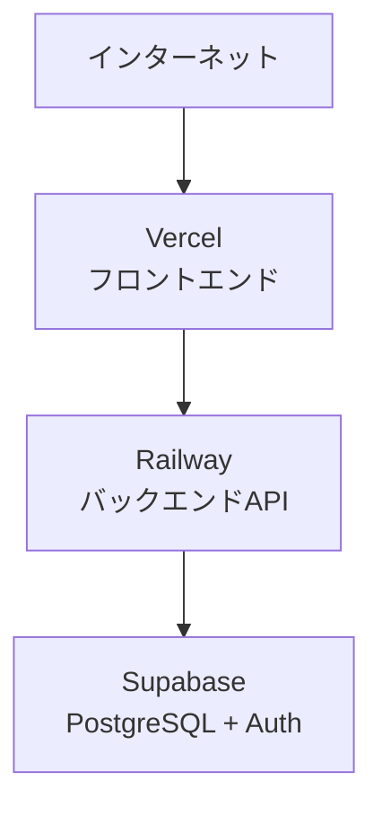
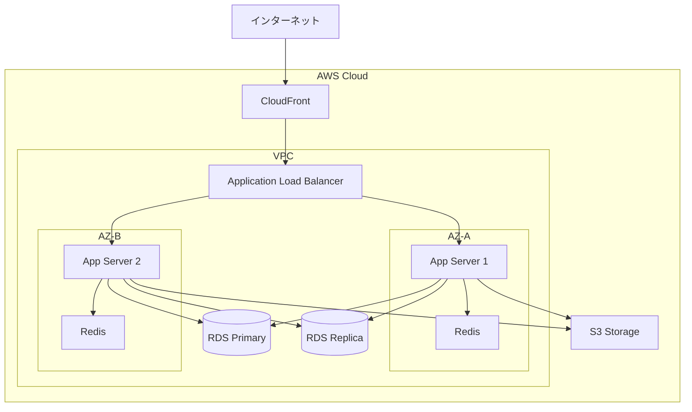

# /a-013-DefineInfrastructure

## 目的

- 技術スタックとアーキテクチャ設計を基に、インフラ構成を定義する。
- クラウドリソース、ネットワーク、セキュリティ、監視を含む全体構成を可視化する。
- 環境ごとの構成（開発、ステージング、本番）を明確化する。
- 高可用性、冗長化、スケーラビリティ、セキュリティの方針を定義する。
- バックアップ、監視、災害復旧の基本方針を記録する。

## 前提

- `docs/project/04-design/01-tech-stack.md` が作成されていること（デプロイ環境、インフラ技術選定済み）
- `docs/project/04-design/06-architecture.md` が作成されていること（推奨）
- `.windsurf/templates/project/04-design/07-infrastructure.md` テンプレートが最新状態であること

## 重要な前提：高レベルなインフラ設計の記録

**このドキュメントは高レベルなインフラ構成の全体像のみを記録**します。詳細な実装仕様は以下で管理：

- **Infrastructure as Code（IaC）**: Terraform、AWS CDK、CloudFormation、Pulumi など
- **設定ファイル**: Docker Compose、Kubernetes マニフェスト、Helm Charts
- **ランブック**: 運用手順書、障害対応手順、デプロイ手順

このドキュメントでは、インフラの構造、環境ごとの違い、基本的な運用方針のみを記載します。

## 手順

### 1. ドキュメントと前提条件の確認

- 関連ドキュメントを読み込む：
  - `@docs/project/04-design/01-tech-stack.md`（インフラ技術、デプロイ環境）
  - `@docs/project/04-design/06-architecture.md`（システムアーキテクチャ）

- ドキュメントが不足している場合：
  - 「技術スタックが定義されていません。最低限、デプロイ環境とインフラ技術の選定が必要です。」
  - 利用可能なドキュメントの範囲でインフラ設計を作成することをユーザーに確認

### 2. クラウドプロバイダーとデプロイ環境の確認

#### 2.1. デプロイ環境の確認

技術スタックドキュメントからデプロイ環境を確認：

**クラウドプロバイダー**:
- **AWS（Amazon Web Services）**
- **GCP（Google Cloud Platform）**
- **Azure（Microsoft Azure）**
- **オンプレミス**
- **ハイブリッド**（クラウド + オンプレミス）

**PaaS（Platform as a Service）**:
- **Vercel**（Next.js、フロントエンド）
- **Netlify**（静的サイト、フロントエンド）
- **Railway**（フルスタック）
- **Render**（フルスタック）
- **Heroku**（フルスタック）
- **Fly.io**（フルスタック）

**コンテナプラットフォーム**:
- **AWS ECS/Fargate**
- **Google Cloud Run**
- **Azure Container Instances**
- **Kubernetes**（EKS、GKE、AKS、自己管理）

#### 2.2. インフラ構成のパターン確認

**質問1: インフラ構成のパターン**
- 「インフラ構成のパターンはどれですか？」

**パターンA: PaaSのみ**（最もシンプル）:
- フロントエンド: Vercel、Netlify
- バックエンド: Railway、Render、Heroku
- データベース: マネージドDB（Supabase、PlanetScale、Neon）
- 特徴: 運用コスト最小、スケーラビリティ自動

**パターンB: クラウドマネージドサービス**:
- コンピューティング: AWS ECS/Fargate、Google Cloud Run
- データベース: AWS RDS、Google Cloud SQL
- ストレージ: AWS S3、Google Cloud Storage
- 特徴: 運用負荷低、柔軟性高

**パターンC: Kubernetes**:
- コンピューティング: Kubernetes（EKS、GKE、AKS）
- データベース: マネージドDB or Kubernetes上にデプロイ
- ストレージ: クラウドストレージ + Persistent Volume
- 特徴: 高度な制御、マルチクラウド対応、運用複雑

**パターンD: 仮想マシン（VM）ベース**:
- コンピューティング: EC2、Compute Engine、Virtual Machines
- データベース: VM上にセルフホスト or マネージドDB
- 特徴: 従来型、柔軟性高、運用負荷高

**パターンE: サーバーレス**:
- コンピューティング: AWS Lambda、Google Cloud Functions
- データベース: DynamoDB、Firestore
- 特徴: スケーラビリティ自動、コールドスタート問題

### 3. ネットワーク構成の定義

#### 3.1. ネットワークアーキテクチャの決定

**質問2: ネットワークセグメント**
- 「ネットワークをどのようにセグメント化しますか？」

**VPC（Virtual Private Cloud）構成**（AWS、GCP、Azureの場合）:

**パブリックサブネット**:
- インターネットゲートウェイへの経路あり
- 配置するコンポーネント：
  - Load Balancer
  - NAT Gateway
  - Bastion Host（踏み台サーバー）

**プライベートサブネット**:
- インターネットゲートウェイへの経路なし
- 配置するコンポーネント：
  - アプリケーションサーバー
  - コンテナ
  - Lambda（VPC内配置の場合）

**データサブネット**（または Database Subnet）:
- 最も制限された領域
- 配置するコンポーネント：
  - データベース（RDS、Aurora）
  - キャッシュ（ElastiCache）

**質問3: Multi-AZ構成**
- 「Multi-AZ（複数のアベイラビリティゾーン）構成にしますか？」
  - はい：高可用性を確保（推奨：本番環境）
  - いいえ：シンプルな構成（開発・ステージング環境）

#### 3.2. セキュリティグループ/ファイアウォールルール

**質問4: セキュリティグループ設計**
- 「セキュリティグループ（ファイアウォールルール）の基本方針は？」

基本方針：
- **最小権限の原則**: 必要最小限のポートのみ開放
- **インバウンドルール**: 許可するトラフィックを明示的に定義
- **アウトバウンドルール**: 通常はすべて許可、または制限

例：
- **ALB Security Group**: インターネットから 80/443 のみ許可
- **App Security Group**: ALB から 8080 のみ許可
- **DB Security Group**: App から 5432（PostgreSQL）のみ許可

### 4. コンピューティングリソースの定義

#### 4.1. コンピューティング選択

技術スタックで選定されたコンピューティングリソースを確認：

**仮想マシン（VM）の場合**:

**質問5: インスタンスタイプ**
- 「各環境のインスタンスタイプは？」
  - 開発: 最小スペック（例：t3.micro、t3.small）
  - ステージング: 中程度（例：t3.medium）
  - 本番: ワークロードに応じて（例：t3.large、m5.xlarge）

**質問6: Auto Scaling**
- 「Auto Scaling（自動スケーリング）を使用しますか？」
  - はい：トラフィックに応じて自動的にインスタンス数を増減
  - いいえ：固定台数

**コンテナの場合**:

**質問7: コンテナ台数**
- 「各環境のコンテナ台数は？」
  - 開発: 1台
  - ステージング: 2台
  - 本番: 最小2台〜最大10台（Auto Scaling）

**質問8: リソース制限**
- 「コンテナのCPU・メモリ制限は？」
  - 例：CPU 0.5 vCPU、メモリ 512 MB

**サーバーレスの場合**:

**質問9: 同時実行数**
- 「Lambda の同時実行数の上限は？」
  - 例：予約された同時実行数 100

### 5. データベース構成の定義

#### 5.1. データベースの選択確認

技術スタックで選定されたデータベースを確認：
- PostgreSQL、MySQL、MongoDB、DynamoDB など

#### 5.2. マネージドDB vs セルフホスト

**質問10: マネージドDB vs セルフホスト**
- 「マネージドデータベースサービスを使用しますか？」
  - **マネージドDB**（推奨）：
    - AWS RDS、Aurora、Google Cloud SQL、Azure Database
    - 自動バックアップ、パッチ適用、高可用性
  - **セルフホスト**：
    - EC2、Compute Engine、VM上にインストール
    - 柔軟性高、運用負荷高

#### 5.3. データベース構成

**質問11: 高可用性構成**
- 「データベースの高可用性構成は？」

**Single-AZ**（開発・ステージング）:
- 1つのアベイラビリティゾーンのみ
- コスト低、可用性低

**Multi-AZ**（本番推奨）:
- Primary（書き込み）と Standby（待機）
- 自動フェイルオーバー
- 高可用性

**Multi-AZ + Read Replica**（大規模本番）:
- Primary（書き込み）
- Standby（フェイルオーバー用）
- Read Replica（読み取り負荷分散）

**質問12: バックアップ保持期間**
- 「自動バックアップの保持期間は？」
  - 例：7日、14日、30日

**質問13: メンテナンスウィンドウ**
- 「メンテナンスウィンドウ（自動パッチ適用のタイミング）は？」
  - 例：日曜日 03:00-04:00 JST

### 6. ストレージ構成の定義

#### 6.1. オブジェクトストレージ

**質問14: オブジェクトストレージの使用**
- 「オブジェクトストレージ（S3、GCS、Azure Blobなど）を使用しますか？」
  - 使用用途：
    - 静的ファイル（画像、動画、ドキュメント）
    - ログファイル
    - バックアップ
    - 静的サイトホスティング

**質問15: ストレージクラス**
- 「ストレージクラスは？」
  - **Standard**: 頻繁にアクセス
  - **Infrequent Access**: 低頻度アクセス（コスト削減）
  - **Glacier/Archive**: アーカイブ（長期保存）

**質問16: バージョニング**
- 「バージョニングを有効化しますか？」
  - 有効：誤削除からの復元可能
  - 無効：ストレージコスト削減

#### 6.2. ブロックストレージ

**質問17: ブロックストレージの使用**（VM使用の場合）
- 「ブロックストレージ（EBS、Persistent Disk）のタイプは？」
  - **SSD（gp3、pd-ssd）**: 汎用、バランス型
  - **HDD（st1、pd-standard）**: スループット重視、コスト低
  - **Provisioned IOPS（io2、pd-extreme）**: 高性能DB向け

### 7. 負荷分散とスケーリングの定義

#### 7.1. ロードバランサー

**質問18: ロードバランサーの種類**
- 「ロードバランサーの種類は？」

**Application Load Balancer（ALB）**:
- HTTP/HTTPS トラフィック
- パスベースルーティング（`/api` → API サーバー）
- ホストベースルーティング（`api.example.com` → API サーバー）

**Network Load Balancer（NLB）**:
- TCP/UDP トラフィック
- 高パフォーマンス、低レイテンシ

**Classic Load Balancer（CLB）**:
- レガシー（非推奨）

**質問19: ヘルスチェック**
- 「ヘルスチェックのエンドポイントは？」
  - 例：`GET /health` または `GET /api/health`
  - 正常応答：200 OK

#### 7.2. Auto Scaling

**質問20: Auto Scaling ポリシー**
- 「Auto Scaling のトリガーは？」

**CPU使用率ベース**:
- CPU > 70% で スケールアウト
- CPU < 30% で スケールイン

**リクエスト数ベース**:
- リクエスト/秒 > 1000 で スケールアウト

**スケジュールベース**:
- 平日 9-18時は最小3台、夜間は最小1台

**質問21: スケーリング範囲**
- 「最小インスタンス数と最大インスタンス数は？」
  - 開発: 最小1台、最大1台（スケーリングなし）
  - ステージング: 最小1台、最大2台
  - 本番: 最小2台、最大10台

### 8. 高可用性・冗長化の定義

#### 8.1. Multi-AZ構成

**質問22: Multi-AZ構成の詳細**
- 「Multi-AZ構成の詳細を確認します。」

**2 AZ構成**（推奨）:
- Availability Zone A と B
- 各AZにアプリケーションサーバー、データベースレプリカを配置
- 1つのAZが障害でも継続稼働

**3 AZ構成**（高可用性重視）:
- Availability Zone A、B、C
- より高い可用性
- コスト増

#### 8.2. フェイルオーバー

**質問23: フェイルオーバー時間**
- 「データベースのフェイルオーバー時間（RTO）は？」
  - RDS Multi-AZ: 通常1-2分
  - Aurora: 通常30秒

### 9. 監視・ログの定義

#### 9.1. 監視ツール

技術スタックで選定された監視ツールを確認：
- CloudWatch、Datadog、New Relic、Prometheus + Grafana など

**質問24: 監視項目**
- 「主要な監視項目は？」

**インフラ監視**:
- CPU使用率、メモリ使用率、ディスク使用率
- ネットワークトラフィック
- ロードバランサーのレスポンスタイム

**アプリケーション監視**:
- API レスポンスタイム
- エラー率（4xx、5xx）
- リクエスト数/秒

**データベース監視**:
- 接続数
- クエリ実行時間
- レプリケーション遅延

**質問25: アラート閾値**
- 「主要なアラート閾値は？」
  - 例：CPU > 80% で5分間継続
  - 例：エラー率 > 5% で3分間継続

#### 9.2. ログ管理

**質問26: ログ集約**
- 「ログをどのように集約しますか？」

**CloudWatch Logs**（AWS）:
- アプリケーションログ、システムログを集約
- Log Insights でクエリ

**ELK Stack**（Elasticsearch、Logstash、Kibana）:
- 高度なログ分析
- カスタムダッシュボード

**Datadog Logs**:
- 統合監視プラットフォーム

**質問27: ログ保持期間**
- 「ログの保持期間は？」
  - 例：30日、90日、1年

### 10. セキュリティの定義

#### 10.1. 暗号化

**質問28: 暗号化方針**
- 「データの暗号化方針は？」

**通信時の暗号化（In-Transit）**:
- HTTPS/TLS の強制
- データベース接続の暗号化（SSL/TLS）

**保存時の暗号化（At-Rest）**:
- データベース暗号化（RDS、Aurora）
- ストレージ暗号化（S3、EBS）
- KMS（Key Management Service）による鍵管理

#### 10.2. アクセス制御

**質問29: IAM（Identity and Access Management）**
- 「IAM の基本方針は？」

**最小権限の原則**:
- 必要最小限の権限のみ付与
- ロールベースアクセス制御（RBAC）

**MFA（多要素認証）**:
- 本番環境へのアクセスには MFA 必須

#### 10.3. ネットワークセキュリティ

**質問30: WAF（Web Application Firewall）**
- 「WAF を使用しますか？」
  - AWS WAF、Cloudflare WAF など
  - SQL Injection、XSS などの攻撃を防御

**質問31: DDoS対策**
- 「DDoS対策は？」
  - AWS Shield、Cloudflare
  - レート制限

### 11. バックアップ・災害復旧の定義

#### 11.1. バックアップ方針

**質問32: バックアップ頻度**
- 「各データストアのバックアップ頻度は？」

**データベース**:
- 自動バックアップ：日次
- スナップショット：週次
- トランザクションログ：連続

**ファイルストレージ**:
- S3 バージョニング有効化
- クロスリージョンレプリケーション（重要データ）

**質問33: バックアップ保持期間**
- 「バックアップの保持期間は？」
  - 日次バックアップ：30日
  - 週次スナップショット：3ヶ月
  - 月次スナップショット：1年

#### 11.2. 災害復旧（DR）

**質問34: RPO（Recovery Point Objective）**
- 「許容可能なデータ損失時間は？」
  - 例：RPO = 1時間（最大1時間分のデータ損失許容）

**質問35: RTO（Recovery Time Objective）**
- 「許容可能なシステム停止時間は？」
  - 例：RTO = 4時間（最大4時間以内に復旧）

**質問36: DR戦略**
- 「災害復旧戦略は？」

**Backup and Restore**（コスト最小）:
- バックアップから復元
- RTO: 数時間〜1日

**Pilot Light**（コスト低）:
- 最小構成を常時稼働
- 災害時にスケールアウト
- RTO: 数時間

**Warm Standby**（コスト中）:
- 縮小版の本番環境を常時稼働
- 災害時にスケールアップ
- RTO: 数分〜数時間

**Multi-Region Active-Active**（コスト最大）:
- 複数リージョンで完全稼働
- RTO: ほぼゼロ

### 12. 環境構成の定義

#### 12.1. 環境の種類

**質問37: 環境の種類**
- 「いくつの環境を用意しますか？」

一般的な環境：
- **開発（Development）**: ローカル開発、最小構成
- **ステージング（Staging）**: 本番に近い構成、テスト用
- **本番（Production）**: 高可用性、冗長化構成
- **（オプション）QA**: QAテスト専用環境

#### 12.2. 環境ごとの違い

各環境について、以下を定義：

| 項目 | 開発 | ステージング | 本番 |
|------|------|------------|------|
| ホスティング | ローカル（Docker） | クラウド（Single-AZ） | クラウド（Multi-AZ） |
| データベース | ローカル（Docker） | RDS Single-AZ | RDS Multi-AZ + Read Replica |
| インスタンス数 | 1 | 1-2 | 2-10（Auto Scaling） |
| バックアップ | なし | 7日保持 | 30日保持 |
| 監視 | 基本 | 標準 | 詳細 + アラート |

### 13. CI/CD パイプラインの概要（オプション）

**質問38: CI/CD パイプライン**
- 「CI/CD パイプラインの概要を記録しますか？」

基本フロー：
1. コードプッシュ（Git）
2. CI：ビルド、テスト、Lintの実行
3. イメージビルド（Docker）
4. コンテナレジストリにプッシュ
5. CD：自動デプロイ（ステージング → 承認 → 本番）

詳細は別ドキュメントまたはCI/CD設定ファイルで管理。

### 14. インフラ構成図の作成

#### 14.1. Mermaid図の作成

収集した情報を基に、Mermaid graph で図を作成。

**シンプルな構成（PaaS）**:

**Multi-AZ構成（AWS）**:

### 15. ドキュメント作成

- 収集した情報を基に、`docs/project/04-design/07-infrastructure.md` を作成

- テンプレートに従い、以下を記載：
  - **インフラ構成図**（Mermaid graph）
  - **環境構成**（開発、ステージング、本番の違い）
  - **主要な運用方針**
    - バックアップ
    - 監視
    - セキュリティ
    - 災害復旧（RPO、RTO）
  - **メモ**（補足情報、Infrastructure as Code へのリンク）

- **HTMLコメントは削除せず残す**

### 16. レビューと確認

- 作成したドキュメントをユーザーに提示：
  - 「インフラ設計ドキュメントが完成しました。内容を確認してください。」
  - 「インフラ構成図は全体像を正確に表現していますか？」
  - 「高可用性・冗長化は適切ですか？」
  - 「セキュリティ対策は十分ですか？」
  - 「コストは許容範囲内ですか？」

### 17. 完成とコミット準備

- `docs/project/04-design/07-infrastructure.md` が保存されたことを確認

- 次のステップを提案：
  - 「インフラ設計が完了しました。次は Infrastructure as Code（Terraform、AWS CDKなど）で実装しますか？」
  - または：「設計フェーズがすべて完了しました。実装フェーズに移行しますか？」

## 完了条件

- `docs/project/04-design/07-infrastructure.md` が作成されている
- 以下のセクションがすべて記載されている：
  - インフラ構成図（Mermaid graph）
  - 環境構成（開発、ステージング、本番の違い）
  - 主要な運用方針（バックアップ、監視、セキュリティ、災害復旧）
- インフラ構成図について：
  - 主要なコンポーネント（コンピューティング、データベース、ストレージ、ネットワーク）がすべて含まれている
  - ネットワークセグメント（Public/Private/Data Subnet）が明確
  - Multi-AZ構成が表現されている（該当する場合）
  - 外部サービスとの連携が記載されている
- 環境構成について：
  - 開発、ステージング、本番の違いが明確
  - 各環境のホスティング、データベース、特徴が記載されている
- 運用方針について：
  - バックアップ頻度、保持期間が明確
  - 監視項目、アラート閾値が定義されている
  - セキュリティ方針（暗号化、アクセス制御）が明確
  - RPO、RTOが定義されている
- 技術スタック、アーキテクチャ設計と整合している
- ユーザーが内容を確認し、承認している

## エスカレーション

- 技術スタックでインフラ技術が選定されていない場合：
  - 「インフラ技術（デプロイ環境、クラウドプロバイダー）が選定されていません。先に `/a-007-DefineTechStack` を実行してください。」

- 単一障害点（Single Point of Failure）が多い場合：
  - 「以下のコンポーネントが単一障害点になっています：[リスト]」
  - 「本番環境では Multi-AZ 構成や冗長化を強く推奨します。」

- セキュリティ対策が不十分な場合：
  - 「以下のセキュリティリスクがあります：」
    - データベースがパブリックサブネットに配置
    - 暗号化が無効
    - セキュリティグループが広すぎる（0.0.0.0/0 を許可）

- バックアップ・DR戦略が不明確な場合：
  - 「バックアップおよび災害復旧戦略が不明確です。RPO、RTOを定義し、適切なバックアップ頻度を設定してください。」

- コストが高すぎる場合：
  - 「この構成はコストが非常に高くなります（推定月額：$X,XXX）。以下の最適化を検討してください：」
    - Reserved Instances / Savings Plans の活用
    - スペックの見直し
    - 開発・ステージング環境の縮小
    - 不要なリソースの削除

- 監視・ログが不足している場合：
  - 「監視・ログ設定が不足しています。障害発生時の原因特定が困難になります。最低限、以下を設定してください：」
    - CPU、メモリ、ディスク使用率の監視
    - アプリケーションログの集約
    - エラー率の監視

- Multi-Region構成が必要なのに Single-Region の場合：
  - 「グローバルサービスまたは高可用性が求められる場合、Multi-Region 構成を検討してください。」

- オーバーエンジニアリングの場合：
  - 「この構成は初期段階には複雑すぎます。MVP段階ではよりシンプルな構成から始め、必要に応じてスケールすることを推奨します。」
